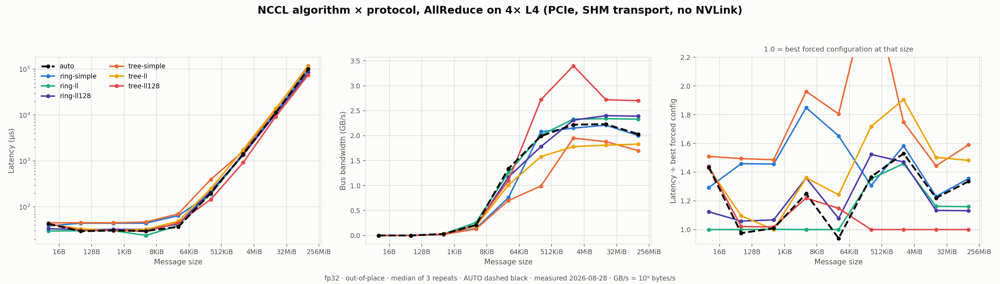
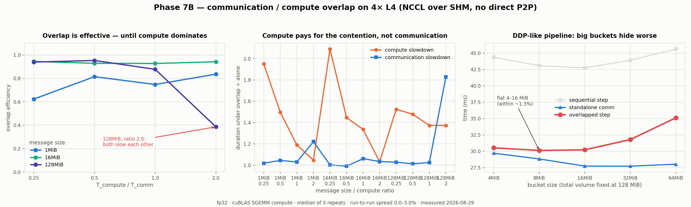
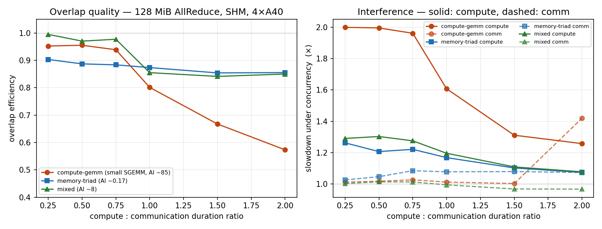
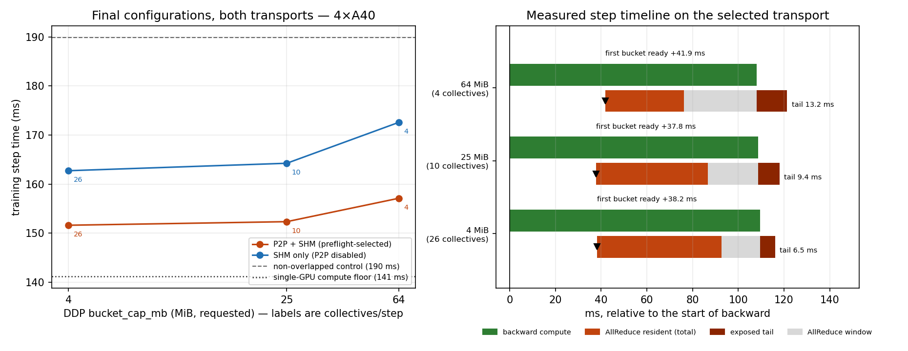
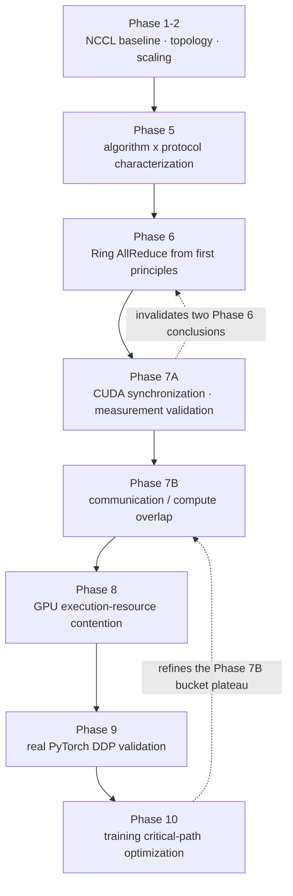

# NCCL Communication Performance Lab

**Topology, collectives, Ring AllReduce, communication/compute overlap, and real
DDP training optimization.**

A distributed-training performance-engineering project. It starts from NCCL
collective baselines and ends at a measured, evidence-based configuration change
in a real PyTorch DDP training loop — with every intermediate claim either
confirmed, revised, or invalidated by a later measurement.

Ten experimental phases, **2 469 schema-validated result rows**, all measured on
rented cloud GPUs and traceable to raw tool output in `results/raw/`.

---

## What this project demonstrates

- **NCCL benchmarking under a correctness gate** — latency, algorithmic and bus
  bandwidth across 8 B → 128 MiB, with a validation check that must pass before
  any number is reported.
- **Topology-aware communication analysis** — why a 4-GPU ring on PCIe keeps
  only ~28 % of its 2-GPU bus bandwidth, read from `nvidia-smi topo -m` and
  NCCL's own transport log rather than assumed.
- **NCCL algorithm × protocol characterization** — Ring/Tree × Simple/LL/LL128
  swept across message sizes, including where NCCL's automatic choice is not the
  best one.
- **A Ring AllReduce written from first principles** — ReduceScatter + AllGather,
  checked against an exact fp32 oracle, with its `2(N−1)/N·M` communication
  volume verified empirically.
- **CUDA synchronization and pipeline analysis** — a WAR race found and fixed, and
  a 3.3× gain traced to removing device-wide barriers rather than guessed at.
- **Nsight Systems profiling and measurement validation** — the profiler was used
  to *invalidate two of this project's own earlier conclusions*.
- **Communication/compute overlap and interference** — per-stream CUDA-event
  measurement showing that overlap is real and that it is not free.
- **GPU execution-resource contention** — DRAM bandwidth ruled out arithmetically
  and empirically as the mechanism.
- **Real PyTorch DDP validation** — a compact GPT trained on 4 GPUs, with DDP's
  bucket behaviour measured rather than inferred from configuration.
- **Reproducible benchmark infrastructure** — a JSON Schema for results, four
  parsers, 72 local tests, credential-redacting environment capture, and a
  functional transport preflight.

---

## Key results

| # | Finding | Evidence |
|---|---|---|
| 1 | **Topology, not rank count, governs collective scaling.** 2→4 GPUs on one node: small-message latency ×1.9 (a tree, not the ×3 a ring predicts); large messages keep only **28.0 / 24.4 / 28.9 %** of bus bandwidth for AllReduce / AllGather / ReduceScatter, because the 4-GPU ring crosses a PCIe host bridge twice. | [Phase 2](docs/experiments/p2-multigpu-scaling.md) |
| 2 | **Protocol dominates small messages, algorithm dominates large.** Below ~4 KiB, LL vs Simple is worth 45–85 % and the algorithm is nearly irrelevant; above ~2 MiB, Tree vs Ring is worth up to 53 %. | [Phase 5](docs/experiments/p5-nccl-algo-protocol.md) |
| 3 | **Ring communication volume verified empirically.** The hand-written ring moved exactly `2(N−1)/N · M` bytes per rank at all five message sizes — the same factor used to convert algorithmic to bus bandwidth. | [Phase 6](docs/experiments/p6-ring-allreduce.md) · reconfirmed in [7A](docs/experiments/p7a-harness-validation.md) |
| 4 | **Removing device-wide synchronization: 3.3×.** Nsight showed **91–93 % of the naive ring's runtime was `syncAll` barriers**; replacing them with per-peer events gave **3.28–3.35×** at ≥ 1 MiB. | [Phase 7A](docs/experiments/p7a-harness-validation.md) |
| 5 | **Overlap is real, and it is not free.** In controlled overlap most of the opportunity is realised, but the compute stream is slowed in *every* measured case (1.03–2.09×), and per-kernel medians barely move while tails inflate up to 13×. | [Phase 7B](docs/experiments/p7b-overlap.md) · [Phase 8](docs/experiments/p8-contention.md) |
| 6 | **DRAM bandwidth ruled out as the contention mechanism.** The collective's own device-memory traffic is ≤ 2.3 % of achievable bandwidth, and the workload consuming ~460 GB/s disturbs it *less* (1.07×) than the one consuming almost none (1.42×). | [Phase 8](docs/experiments/p8-contention.md) |
| 7 | **In real DDP, the requested bucket capacity is not the collective size.** DDP cannot split a parameter, so a single 50 MiB output projection formed one indivisible bucket — no `bucket_cap_mb` below ~48 MiB could touch a third of this model's gradient traffic. | [Phase 9](docs/experiments/p9-ddp-training.md) |
| 8 | **Aggregate NCCL time ≠ training communication penalty.** 85.4 ms of communication cost only 16.1 ms of step time; DDP absorbed 81 % of it. Overlap is worth **20–30 %** of step time against an identical serialised reduction. | [Phase 9](docs/experiments/p9-ddp-training.md) · [Phase 10](docs/experiments/p10-final-optimization.md) |
| 9 | **Negative control: the most efficient collectives lost.** `bucket_cap_mb = 64` produced the fewest, largest and individually fastest collectives and **22 % less total NCCL kernel time per step** — and was **3.6 % slower** end-to-end (6.1 % on an SHM-only host), because the exposed tail grew from 6.5 to 13.2 ms. | [Phase 10](docs/experiments/p10-final-optimization.md) |
| 10 | **A capability bit is not a functional test.** Across four cloud hosts `cudaDeviceCanAccessPeer` returned *yes* every time; the P2P path silently corrupted data on one, deadlocked on two others, and worked on the fourth. | Phases [6](docs/experiments/p6-ring-allreduce.md), [8](docs/experiments/p8-contention.md), [9](docs/experiments/p9-ddp-training.md), [10](docs/experiments/p10-final-optimization.md) |

### The final optimization, stated precisely

Reducing `bucket_cap_mb` from **25 → 4** on the Phase 10 workload cut the
exposed synchronisation penalty by **8.5 %** (10.72 → 9.81 ms) and step time by
**0.48 %** (152.35 → 151.62 ms; 430 181 → 432 126 tokens/s; scaling efficiency
92.7 % → 93.1 %).

**That step-time difference is below cross-run noise on that host and is not
claimed as a reliable speedup.** On the same host with P2P disabled — a slower
SHM-only path with more scheduling headroom — the same change is **0.93 %**,
resolvable but still under 1 %. The robust, reproducible result is the negative
control in row 9: avoid very large buckets.

**Bucket tuning is transport-dependent.** On slower SHM-only hosts there is more
exposed tail to reclaim and small buckets measurably help; on a host with a
functionally healthy `P2P/CUMEM` + `SHM` ring the 4 MiB vs 25 MiB difference
becomes statistically indistinguishable. **No bucket size is presented as
universally optimal.**

---

## Figures

| Topology and scaling — [Phase 2](docs/experiments/p2-multigpu-scaling.md) | Algorithm × protocol — [Phase 5](docs/experiments/p5-nccl-algo-protocol.md) |
|---|---|
|  |  |
| **Custom Ring V1/V2/V3 — [Phase 6](docs/experiments/p6-ring-allreduce.md)** | **Communication/compute overlap — [Phase 7B](docs/experiments/p7b-overlap.md)** |
|  |  |
| **Resource contention — [Phase 8](docs/experiments/p8-contention.md)** | **Final DDP result and step timeline — [Phase 10](docs/experiments/p10-final-optimization.md)** |
|  |  |

Detailed figures live in the individual experiment reports.

---

## Experiment flow



Each solid arrow is a question the previous phase raised and the next one
answered. The dotted arrows are corrections — later measurement overturning
earlier conclusions in this same repository.

---

## Experiment index

| Phase | Purpose | Major finding | Report |
|---|---|---|---|
| 1 / 1B | First real NCCL baseline, 2 GPUs | Bandwidth plateaus cleanly at ≈ 11 GB/s; the limit could not be attributed to a specific link | [p1b](docs/experiments/p1b-first-2gpu-nccl-baseline.md) |
| 2 | 2 vs 4 GPU scaling on one node | Two regimes: tree-like small-message growth, ~72 % bus-bandwidth loss at large sizes | [p2](docs/experiments/p2-multigpu-scaling.md) |
| 3 | Multi-node TCP baseline | **Deferred on cost** — cheapest schedulable cluster is $25.44/hr, 8.5× the project threshold. Design preserved. | [p3](docs/experiments/phase3_multinode_tcp_baseline.md) |
| 4 | Single-node topology isolation | Deferred by user; design preserved | — |
| 5 | NCCL algorithm and protocol | Protocol rules small messages, algorithm rules large; AUTO is good but systematically misses at large sizes | [p5](docs/experiments/p5-nccl-algo-protocol.md) |
| 6 | Ring AllReduce from scratch | `2(N−1)/N·M` verified; a WAR race found; `canAccessPeer` proven untrustworthy | [p6](docs/experiments/p6-ring-allreduce.md) |
| 7A | Profiling and measurement validation | The Phase 6 "harness floor" was the *host*; 91–93 % of the naive ring was barriers | [p7a](docs/experiments/p7a-harness-validation.md) |
| 7B | Communication/compute overlap | 62–95 % of overlap opportunity realised; compute slowed 1.03–2.09× | [p7b](docs/experiments/p7b-overlap.md) |
| 8 | Which resource is contended | Not DRAM bandwidth; medians flat, tails inflate — an execution-resource effect | [p8](docs/experiments/p8-contention.md) |
| 9 | Real PyTorch DDP validation | Microbenchmarks predicted the real collective within 7.8 %; requested bucket cap ≠ collective size | [p9](docs/experiments/p9-ddp-training.md) |
| 10 | Final evidence-based optimization | The optimization is real but small and shrinks on faster fabric; the large-bucket cliff is the robust result | [p10](docs/experiments/p10-final-optimization.md) |
| 11 | Portfolio and reproducibility finalization | Claim audit, minimal reproduction path; all 13 summaries regenerate byte-for-byte from raw | this README · [REPRODUCING](docs/REPRODUCING.md) |

---

## Reliability workflow

Three hosts in this project produced wrong data or a deadlock on a P2P path that
every capability query reported as available. The preflight below
(`scripts/preflight_ddp.sh`) exists because of that, and runs before any
benchmark:

```text
hardware discovery        nvidia-smi -L, driver, memory
        ↓
topology inspection       nvidia-smi topo -m
        ↓
capability discovery      cudaDeviceCanAccessPeer   ← recorded, NOT believed
        ↓
functional communication  a real DDP step on each candidate transport
        ↓
timeout / hang guard      a deadlock fails the candidate instead of hanging the run
        ↓
numerical correctness     loss finite ∧ grads finite ∧
                          max |p_rank − p_rank0| == 0
        ↓
benchmark  →  profiler  →  result validation (schema + correctness flags)
```

If no transport passes, the script exits non-zero and **nothing is benchmarked**.

This is an observation about the four cloud hosts tested here. It is *not* a
claim that A40 or L4 hardware, or this provider, has a general P2P defect — on
the fourth host the same gate accepted NCCL's default P2P ring.

---

## Reproducing this work

See **[docs/REPRODUCING.md](docs/REPRODUCING.md)** for environment assumptions,
dependencies, and the full guide. The recommended minimal path is six steps; you
do not need to rerun every historical experiment.

Parsing and analysis are GPU-free and run anywhere:

```bash
python3 -m pytest tests/ -q                    # 72 tests, no GPU required
python3 scripts/analyze_ddp.py results/summary/p10-*/results.jsonl \
        --prefix final- --baseline 25 --optimized 4
```

---

## What did not work, and what changed

Negative results are kept because they are the part of the record that shows how
the conclusions were actually reached.

- **`cudaDeviceCanAccessPeer` is not operational validation.** On one host the
  bit was set and peer copies returned NaN; on two others NCCL built its rings
  and then deadlocked on the first collective; on a fourth the same path worked.
- **A Phase 6 timing anomaly was attributed to the wrong thing.** A "~4.4 ms
  harness floor" was reported as a property of the benchmark harness. Phase 7A
  measured the harness at ≈ 27 µs and showed the floor followed the *host*. Two
  Phase 6 performance conclusions were **invalidated** and three revised; the
  Phase 6 report is preserved unedited with a pointer to the correction.
- **The V3 subchunk pipeline did not reproduce.** Its 1.22× gain at 16 MiB
  became **0.93× (slower)** on a second host. It is not presented as a result.
- **Nsight Compute was unavailable.** Hardware counters need privileges a
  container tenant does not have (`ERR_NVGPUCTRPERM`). Attempted once, recorded,
  not retried — so Phase 8 makes **no hardware-counter claim** about the exact
  scheduler mechanism, and every arithmetic-intensity figure is labelled *by
  construction*.
- **DRAM bandwidth was ruled out, not confirmed.** Phase 8's headline is a
  negative: the evidence points away from the bandwidth explanation, and the
  positive mechanism is stated as *consistent with* execution-resource
  contention, with the granularity/intensity confound left explicit.
- **The final optimization is below noise on the faster transport.** 4 MiB vs
  25 MiB is 0.48 % against a 0.81 ms noise floor on the Phase 10 host. Reported
  as indistinguishable rather than dressed up.
- **Phase 3 was deferred on cost**, and Phase 4 by user decision. Neither is
  presented as completed work.

Historical reports are left intact; corrections are dated notes added at the
top of the affected report, not silent rewrites.

---

## Engineering lessons

1. **Topology determines effective collective performance** far more than rank
   count does; a ring runs at the speed of its slowest hop.
2. **Algorithm × protocol × topology × message size interact.** No single
   configuration wins everywhere, and the crossovers are measurable.
3. **Asynchronous APIs do not guarantee overlap.** Issuing work on separate
   streams is necessary, not sufficient.
4. **Global synchronization can dominate naive communication code** — 91–93 % of
   the first ring implementation was barriers, invisible without a profiler.
5. **Overlap is not free.** A resident collective measurably slows concurrent
   compute; the cost shows up in kernel *tails*, not medians.
6. **Isolated NCCL time is not the training penalty.** The configuration with
   the least total collective time was the slowest to train.
7. **End-to-end step time is the optimization objective.** Overlap percentage is
   a diagnostic.
8. **Capability discovery is not functional validation.** Test the path with a
   real collective and an invariant that corruption would break.
9. **Measurement calibration is part of performance engineering.** Validating
   the apparatus overturned two of this project's own conclusions.
10. **A result below the noise floor is a result** — reporting it as such is
    cheaper than defending an inflated number later.

---

## Cost

Every experiment ran on the cheapest hardware that could answer its question, and
compute was released as soon as measurement finished.

| Phase | Hardware | Rate | Cost | Basis |
|---|---|---|---:|---|
| 1B | 2× RTX 3070 (community) + 2× L4 | $0.26 / $0.98 /hr | $0.22 | lifecycle estimate |
| 2 | 4× RTX PRO 4500 Blackwell | $2.88/hr | *not recorded* | — |
| 3 | none — deferred on cost | — | $0.00 | no resource provisioned |
| 5 | 4× L4 (two pods) | $1.96/hr | $0.82 | lifecycle estimate |
| 6 | 4× L4 | $1.96/hr | ≈ $1.14 | lifecycle estimate |
| 7A | 4× L4 | $1.96/hr | **$0.33** | **billed** |
| 7B | 4× L4 | $1.96/hr | **$0.23** | **billed** |
| 8 | 4× A40 (two pods) | $1.76/hr | **$1.23** | **billed** — the report's $1.65 lifecycle estimate was 26 % high |
| 9 | 4× A40 | $1.76/hr | $1.90 | lifecycle estimate |
| 10 | 4× A40 (two pods) | $1.76/hr | $0.94 | lifecycle estimate |

**Billed and verified: $1.79.** **Lifecycle-estimated: ≈ $5.02.** Phase 2's total
was not recorded and is not invented here, so the project total is
**≈ $6.8 plus Phase 2**. Every configuration stayed at or under the $3.00/hour
autonomous threshold; none required approval.

Where billing settled after a report was written, the report carries a dated
correction rather than a silent edit.

---

## Benchmark integrity

- Correctness is verified before any performance number is reported. A benchmark
  result whose correctness was not established is not a result.
- Measured numbers come from experiments that actually ran. Theoretical,
  estimated, and vendor-advertised figures are labelled and never presented as
  measurements. The schema carries an explicit `value_kind`
  (`measured` / `estimated` / `theoretical` / `synthetic`).
- Raw tool output is preserved unmodified and kept separate from parsed
  summaries. Results are never overwritten; every run has a unique experiment ID.
- Environment capture uses an allowlist with credential redaction, so secrets
  cannot reach results or version control.
- **No RoCE, InfiniBand, RDMA or NVLink result exists or is claimed anywhere in
  this repository.** None of that hardware was ever present.

---

## Limitations and future work

Completed work is single-node, 2–4 GPUs, on `SHM/direct` or `P2P/CUMEM`
transports. The following are **not** missing functionality — they are the
experiments this project did not run:

- **NVLink systems** — every ratio between compute and communication shifts, and
  Phase 10 predicts the bucket optimization shrinks further while the
  large-bucket cliff persists.
- **Real multi-node RDMA / RoCE / InfiniBand** — deferred in Phase 3 because the
  cheapest schedulable cluster was 8.5× the cost threshold.
- **MoE AllToAll** — a different collective with a different scaling story.
- **Hardware-counter profiling on an unrestricted host** — would let Phase 8's
  mechanism be confirmed rather than inferred.
- **Kernel-granularity isolation** — the one confound Phase 8 could not remove:
  granularity and arithmetic intensity covary in its design.
- **Larger training workloads** — 82.6 M parameters is small, and bucket
  structure depends on model shape.

---

## Repository structure

```text
docs/
  design/          RFCs: project plan, result schema
  experiments/     one report per phase — the primary record
  REPRODUCING.md   environment, dependencies, minimal reproduction path
  PORTFOLIO.md     project summary, resume bullets, interview guide
schemas/           machine-readable result schema (JSON Schema)
scripts/           env capture, preflight, benchmark runners, parsers, analysis, plots
src/
  ring_allreduce/  Ring AllReduce written from first principles
  overlap/         communication/compute overlap and contention benchmark
  ddp/             compact GPT + PyTorch DDP training benchmark
  collectives/     collective communication code
  p2p/             point-to-point code
tests/             72 local tests, no GPU required
results/
  raw/             verbatim tool output, append-only, one directory per experiment ID
  summary/         parsed, schema-validated JSONL + CSV
  plots/           generated figures
benchmarks/        per-transport benchmark configurations
```

## Documentation

- [`docs/REPRODUCING.md`](docs/REPRODUCING.md) — reproducibility guide
- [`docs/PORTFOLIO.md`](docs/PORTFOLIO.md) — summary, resume bullets, interview guide
- [`docs/design/RFC-000-project-plan.md`](docs/design/RFC-000-project-plan.md) — project plan and phase status
- [`docs/design/RFC-001-result-schema.md`](docs/design/RFC-001-result-schema.md) — result schema
- [`PROJECT_CONTEXT.md`](PROJECT_CONTEXT.md) — project context and phase definitions
