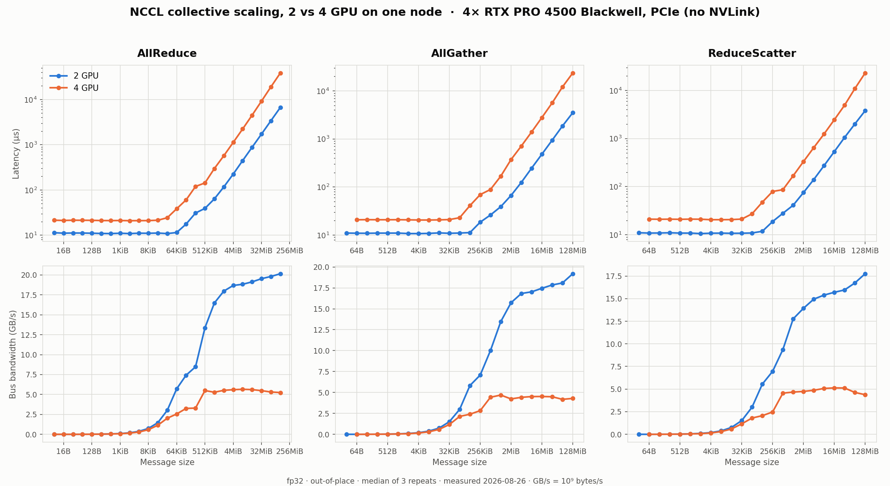

# NCCL / RDMA Communication Benchmark

A systems-oriented GPU communication benchmarking and optimization project
for distributed AI training.

The project investigates the communication stack behind multi-GPU and
multi-node LLM training, including NCCL collectives, GPU topology,
RDMA networking, RoCE, InfiniBand, communication profiling, and
collective algorithm implementation.

## Motivation

Distributed LLM training performance is determined not only by GPU compute
but also by communication.

At scale, operations such as:

- AllReduce
- AllGather
- ReduceScatter
- Point-to-Point communication

can become major training bottlenecks.

This project studies these mechanisms experimentally rather than treating
NCCL as a black box.

## Goals

The project aims to:

- benchmark NCCL collective communication;
- measure latency and bandwidth across message sizes;
- analyze intra-node GPU topology;
- study inter-node communication;
- investigate RoCE and InfiniBand;
- analyze NCCL algorithms and communication paths;
- implement a simplified Ring AllReduce;
- profile GPU communication behavior;
- investigate communication/computation overlap;
- identify and optimize real communication bottlenecks.

## Communication Operations

Primary collectives:

- Point-to-Point
- AllReduce
- AllGather
- ReduceScatter
- Broadcast

## Metrics

Important metrics include:

- latency
- algorithmic bandwidth
- bus bandwidth
- scaling efficiency
- communication time
- GPU utilization
- CPU utilization
- GPU idle time
- communication/computation overlap

## Experimental Layers

The project progresses through increasingly complex infrastructure:

```text
Local development
        ↓
Single GPU
        ↓
Single-node multi-GPU
        ↓
Multi-node TCP
        ↓
RoCE
        ↓
InfiniBand
```

## Project Status

**Current phase: Phase 1 — NCCL baseline (preparation).**

Phases 1 and 2 have been **measured on real hardware** — 1404 result rows across
three configurations, every one with zero validation errors:

- [Phase 1B](docs/experiments/p1b-first-2gpu-nccl-baseline.md) — first baseline,
  2 × NVIDIA L4, single node.
- [Phase 2](docs/experiments/p2-multigpu-scaling.md) — 2 vs 4 GPU scaling,
  4 × RTX PRO 4500 Blackwell, single node.

No later phase has been executed. Nothing has been measured on NVLink,
multi-node, RoCE, or InfiniBand hardware.

### Headline result: collective scaling is governed by topology, not rank count



Stepping from 2 to 4 GPUs on one node produced two distinct regimes:

| | AllReduce | AllGather | ReduceScatter |
|---|---:|---:|---:|
| Small-message latency (≤ 1 KiB) | 1.91× | 1.90× | 1.93× |
| Large-message latency (≥ 4 MiB) | 5.23× | 5.88× | 4.64× |
| **Peak bus bandwidth retained** | **28.0%** | **24.4%** | **28.9%** |

Small-message latency grew by ≈ 1.9×, matching a `log₂(n)` **tree** and rejecting
the `2(n−1)` **ring** prediction of 3× — NCCL's algorithm choice is visible in the
timing data. Large messages lost roughly three quarters of their bus bandwidth,
because the 4-GPU ring is forced across a PCIe host-bridge boundary twice
(`isAllDirectP2p 0`), and a ring runs at the speed of its slowest hop.

| Phase | Scope | Status |
|-------|-------|--------|
| 0 | Development platform and infrastructure automation | Complete |
| 1 | NCCL baseline | Complete — first baseline measured 2026-08-26 |
| 2 | Single-node multi-GPU topology and collective benchmarks | Complete — 2 vs 4 GPU scaling measured 2026-08-26 |
| 3 | Multi-node TCP baseline | Preparation complete; measurement deferred on cost |
| 4 | Single-node topology isolation | Deferred by user; design preserved |
| 5 | NCCL algorithm and protocol characterization | Complete — measured 2026-08-28 |
| 6 | Simplified Ring AllReduce | Complete — measured 2026-08-28 |
| 7 | Communication profiling | Complete — 7A harness validation + 7B overlap, 2026-08-29 |
| 8 | Communication optimization | Not started |
| 9 | Reproducibility and final portfolio documentation | Not started |

RoCE and InfiniBand were originally Phases 4 and 5. Both have moved to future
work: Phase 3 established that the cheapest schedulable multi-node cluster
costs **$25.44/hour, 8.5× this project's cost threshold**, and RDMA fabrics
need that infrastructure or better. **No RoCE or InfiniBand result exists or is
claimed anywhere in this repository.**

## Benchmark Integrity

This project treats measurement honesty as a first-class engineering
requirement, not a disclaimer:

- Correctness is verified before any performance number is reported. A
  benchmark result whose correctness was not established is not a result.
- Measured numbers come from experiments that actually ran. Theoretical,
  estimated, and vendor-advertised figures are labelled as such and are never
  presented as measurements.
- RoCE claims require real RoCE hardware. InfiniBand claims require real
  InfiniBand hardware. TCP results are never substituted for RDMA results.
- Raw tool output is preserved unmodified and kept separate from parsed
  summaries. Results are never overwritten; every run gets a unique
  experiment ID.

The result schema carries an explicit `value_kind` field
(`measured` / `estimated` / `theoretical` / `synthetic`) so these categories
cannot be silently confused, and the parser refuses to tag synthetic test
fixtures as measurements.

## Reproducibility

Every experiment records the metadata needed to reproduce it: experiment ID,
timestamp, git commit, provider, GPU model and count, node count, topology,
network type, CUDA and driver versions, NCCL version, compiler, MPI where
relevant, message sizes, datatype, iteration and warmup counts, environment
variables, and the exact command executed.

Environment capture uses a variable allowlist with credential redaction, so
secrets cannot reach results or version control.

## Repository Structure

```text
docs/
  design/          RFCs: project plan, result schema
  experiments/     per-experiment design documents
  theory/          background notes
schemas/           machine-readable result schema (JSON Schema)
scripts/           environment capture, benchmark runner, parser
src/
  collectives/     collective communication code
  p2p/             point-to-point code
  ring_allreduce/  simplified Ring AllReduce implementation
benchmarks/        per-transport benchmark configurations
tests/             local tests (no GPU required)
results/
  raw/             verbatim tool output, append-only
  summary/         parsed, machine-readable results
profiles/          profiling traces
plots/             generated figures
```

## Local Validation

The parsing and analysis layer is developed and tested without a GPU:

```bash
python3 tests/test_parse_nccl_output.py
```

## Infrastructure

Experiments run on rented cloud GPUs, provisioned and released
programmatically. Infrastructure is selected cost-consciously: the cheapest
configuration capable of correctly answering the current engineering question,
with local development preferred over paid GPU time, and compute terminated as
soon as measurement finishes rather than left running during analysis.

## Documentation

- [`docs/design/RFC-000-project-plan.md`](docs/design/RFC-000-project-plan.md) — overall project plan
- [`docs/design/RFC-001-result-schema.md`](docs/design/RFC-001-result-schema.md) — result schema
- [`docs/experiments/phase1_nccl_baseline.md`](docs/experiments/phase1_nccl_baseline.md) — Phase 1 experiment design
- [`PROJECT_CONTEXT.md`](PROJECT_CONTEXT.md) — project context and phase definitions
