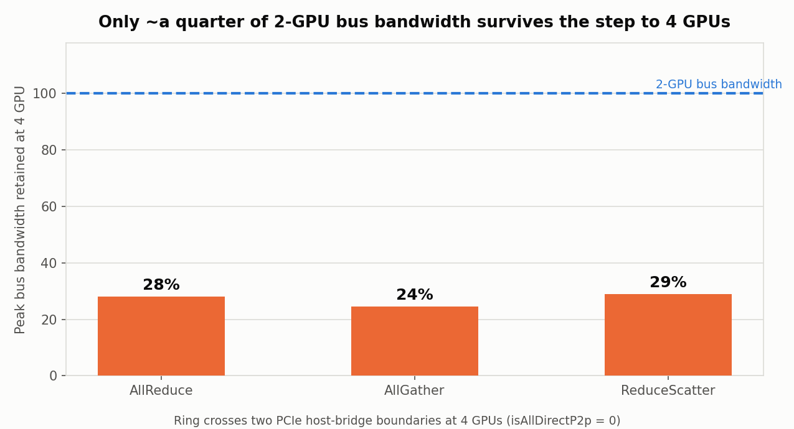

# Phase 2 — Single-Node Multi-GPU NCCL Scaling (2 vs 4 GPU)

Status: **completed**
Experiment IDs:
`p2-scaling-g2-20260826T185443Z-cbb1f68` (2 GPU) ·
`p2-scaling-g4-20260826T185443Z-cbb1f68` (4 GPU)
Date (UTC): 2026-08-26
Repo commit: `cbb1f68`
Previous: [`p1b-first-2gpu-nccl-baseline.md`](p1b-first-2gpu-nccl-baseline.md)

> All numbers are **measured**, traceable to raw nccl-tests output under
> `results/raw/`. **No NVLink, RoCE, InfiniBand, RDMA or multi-node behaviour is
> measured or claimed** — none of that hardware was present.

---

## 1. Purpose

Compare how AllReduce, AllGather and ReduceScatter scale from 2 to 4 GPUs on a
**single node**, using the validated Phase 1 framework unchanged.

**Both configurations ran on the same pod, same GPUs, same NCCL build.** The
2-GPU run used `-g 2` and the 4-GPU run `-g 4` on the identical machine. This
removes hardware, driver, and software variation from the comparison entirely —
the only independent variable is rank count.

Per instruction, no host-specific PCIe forensic was performed. The topology
evidence quoted below comes from data the harness already collects.

---

## 2. Infrastructure

| Field | Value |
|-------|-------|
| Provider / cloud | RunPod, SECURE, EU-RO-1 |
| Pod ID | `xob6m18z94tqlr` |
| GPU | NVIDIA RTX PRO 4500 Blackwell × **4** (single node) |
| Compute capability | 12.0 (sm_120) |
| **Quoted price** | **$0.72 / GPU / hour → $2.88 / hour total** |
| Approval | Under the $3.00/hour threshold → autonomous |
| Pod lifetime | ≈ 13 min (18:45:15 → ≈ 18:58 UTC) |
| **Cost** | **≈ $0.62** (target was ≤ $3) |

Six cheaper 4-GPU configurations were attempted first and all returned
`no longer any instances available`: RTX A4000 ($1.00/hr), RTX A4500 ($1.00/hr),
RTX 4000 Ada ($1.12/hr), A40 ($1.76/hr), L4 ($1.96/hr). RTX PRO 4500 was the
first with real stock (the only MEDIUM-availability option in the catalog).

### Software

| Field | Value |
|-------|-------|
| OS / driver | Ubuntu 24.04, driver 580.126.09 |
| CUDA (nvcc) | 12.8 |
| **NCCL** | **2.31.2+cuda12.9** (see §4 — *not* the container's 2.25.1) |
| nccl-tests | 2.19.7, commit `717b68318278e93f371d8ffb46b076069d7c7851` |
| MPI | not installed (single-process multi-GPU, by design) |

---

## 3. Topology (inspected before running)

```text
        GPU0    GPU1    GPU2    GPU3    CPU Affinity   NUMA
GPU0     X      PHB     NODE    NODE    0-127          0
GPU1    PHB      X      NODE    NODE    0-127          0
GPU2    NODE    NODE     X      PHB     0-127          0
GPU3    NODE    NODE    PHB      X      0-127          0
```

| GPU | PCI bus | PCIe link (max) |
|-----|---------|-----------------|
| 0 | `0000:81:00.0` | Gen4 ×16 |
| 1 | `0000:82:00.0` | Gen4 ×16 |
| 2 | `0000:C1:00.0` | Gen4 ×16 |
| 3 | `0000:C2:00.0` | Gen4 ×16 |

**No NVLink** (no `NV#` entries; `nvlink_present: false`). The four GPUs form
**two pairs**: GPU0–GPU1 share one PCIe host bridge (`PHB`), GPU2–GPU3 share
another, and any cross-pair path is `NODE` — traversing the interconnect
*between* host bridges.

*Caveat on link state:* environment capture runs before the benchmark, while the
GPUs are idle, so `pcie.link.gen.current` read Gen1 for the idle pair (power
management downclocks the link). The `max` column above is the meaningful figure.

### What NCCL did with that topology — the key evidence

| Configuration | NCCL report |
|---------------|-------------|
| **2 GPU** | `Check P2P Type isAllDirectP2p 1` — every channel `via P2P/direct pointer` |
| **4 GPU** | `Check P2P Type isAllDirectP2p 0` — **not all pairs have direct P2P** |

Both configurations built 2 channels and used ring + tree algorithms; NVLS
multicast was unavailable on all devices. The ring at 4 GPUs is `0 1 2 3`, which
**crosses the host-bridge boundary twice** (1→2 and 3→0). A ring runs at the
speed of its slowest hop.

---

## 4. Defect found and fixed during execution

The first attempt **failed the smoke gate on all three collectives** (exit 3).
The gate worked exactly as designed: the full sweep was never launched, so no
GPU time was wasted on a broken configuration.

Diagnosis, from `NCCL_DEBUG=INFO`:

```text
enqueue.cc:1500 NCCL WARN Cuda failure 1 'invalid argument'
```

NCCL initialised **completely** — bootstrap, topology detection, and P2P channel
setup all succeeded — and failed only when launching the collective kernel. The
container's **NCCL 2.25.1 does not support sm_120 (Blackwell)**: its precompiled
device kernels cannot launch on this architecture.

An initial hypothesis that nccl-tests' `NVCC_GENCODE` lacked sm_120 was tested by
rebuilding with `-gencode=arch=compute_120,code=sm_120` — **it did not fix the
failure**, which correctly redirected the diagnosis to NCCL itself rather than
the test harness.

Fix: install NCCL 2.31.2 into an isolated prefix and rebuild nccl-tests against
it (`NCCL_HOME` + `LD_LIBRARY_PATH`). Both 2-GPU and 4-GPU then passed with zero
validation errors. The failed run is preserved as evidence under
`results/raw/p2-scaling-{g2,g4}-20260826T184532Z-cbb1f68/`.

**A metadata check that paid off.** `env.json` recorded `nccl_version: 2.25.1`,
detected from the stale system header `/usr/include/nccl.h`. The parser instead
records **2.31.2+cuda12.9** from the run's own `NCCL_DEBUG=VERSION` banner, with
`nccl_version_source: "NCCL_DEBUG=VERSION banner"`. The RFC-001 rule of
preferring the runtime banner over environment probing caught what would
otherwise have been a silently wrong version on every result row.

---

## 5. Correctness

| Check | 2 GPU | 4 GPU |
|-------|-------|-------|
| Runs | 12 | 12 |
| Failed runs | **0** | **0** |
| Rows parsed | **468** | **468** |
| `value_kind` | all `measured` | all `measured` |
| `#wrong` max | **0** | **0** |
| `correctness_ok = false` | **0** | **0** |
| Schema valid | 468/468 | 468/468 |

### n-rank sanity check (busbw / algbw)

The expected factor **changes with rank count**, so this also verifies rank
handling:

| Collective | n=2 expected | n=2 observed | n=4 expected | n=4 observed |
|------------|-------------:|-------------:|-------------:|-------------:|
| AllReduce | 1.0000 | **1.0000** | 1.5000 | **1.5002** |
| AllGather | 0.5000 | **0.5002** | 0.7500 | **0.7501** |
| ReduceScatter | 0.5000 | **0.5000** | 0.7500 | **0.7502** |

All pass at both rank counts.

---

## 6. Results


Out-of-place, median of 3 repeats. GB/s = 10⁹ bytes/s.

### Headline table

| Collective | Config | Latency floor | Peak algbw | Peak busbw | Saturation size |
|------------|--------|--------------:|-----------:|-----------:|----------------:|
| AllReduce | 2 GPU | 11.36 µs | 20.15 GB/s | 20.15 GB/s | 32 MiB |
| AllReduce | 4 GPU | 21.46 µs | 3.77 GB/s | 5.65 GB/s | 512 KiB |
| AllGather | 2 GPU | 10.99 µs | 38.38 GB/s | 19.19 GB/s | 128 MiB |
| AllGather | 4 GPU | 20.78 µs | 6.25 GB/s | 4.69 GB/s | 1 MiB |
| ReduceScatter | 2 GPU | 11.01 µs | 35.50 GB/s | 17.75 GB/s | 128 MiB |
| ReduceScatter | 4 GPU | 21.14 µs | 6.84 GB/s | 5.13 GB/s | 8 MiB |

### 2 → 4 GPU scaling

| Metric | AllReduce | AllGather | ReduceScatter |
|--------|----------:|----------:|--------------:|
| Latency floor | **1.89×** | **1.89×** | **1.92×** |
| Small-message latency (≤ 1 KiB) | 1.91× | 1.90× | 1.93× |
| Large-message latency (≥ 4 MiB) | **5.23×** | **5.88×** | **4.64×** |
| Latency @ 128 MiB | 5.76× | 6.71× | 6.08× |
| Peak bus bandwidth | 0.28× | 0.24× | 0.29× |
| **Bus bandwidth retained** | **28.0%** | **24.4%** | **28.9%** |



### Run-to-run variance (≥ 1 MiB, 3 repeats)

| Config | AllReduce | AllGather | ReduceScatter |
|--------|----------:|----------:|--------------:|
| 2 GPU | 0.16% (max 0.30%) | 0.26% (max 0.63%) | 0.26% (max 0.71%) |
| 4 GPU | 1.36% (max 7.49%) | **4.19% (max 10.46%)** | 2.71% (max 7.33%) |

Variance grows by roughly an order of magnitude at 4 GPUs. More ranks means more
synchronisation coupling: every rank waits on the slowest, so per-iteration
jitter that two ranks can absorb becomes visible with four.

---

## 7. Analysis

### 7.1 Two different scaling regimes

The 2→4 step behaves completely differently at small and large messages:

- **Small messages: ≈ 1.9×** — near-identical across all three collectives.
- **Large messages: ≈ 4.6–6.7×** — far worse than the rank count grew.

These have different causes and should not be averaged together.

### 7.2 Small messages: latency tracks log₂(n), not the ring

The latency floor rose from ≈ 11 µs to ≈ 21 µs, a factor of **1.89–1.92** for all
three collectives.

A ring at n ranks needs `2(n−1)` steps for AllReduce — 2 steps at n=2, 6 at n=4,
predicting **3×**. A tree needs `log₂(n)` levels — 1 then 2, predicting **2×**.

The measured 1.89–1.92× matches the **tree** prediction and clearly rejects the
ring one. The `NCCL_DEBUG=INFO` log confirms NCCL built trees alongside rings
(`Trees [0] 1/-1/-1->0->-1 …`) and selects them for latency-bound sizes. The data
and the log agree.

### 7.3 Large messages: the ring inherits its slowest hop

At 4 GPUs only **24–29%** of the 2-GPU bus bandwidth survives — a far bigger loss
than any per-rank overhead explains.

The mechanism is visible in the NCCL log rather than inferred: at 2 GPUs
`isAllDirectP2p 1` (both GPUs on one host bridge, direct P2P); at 4 GPUs
`isAllDirectP2p 0`. The 4-GPU ring `0 1 2 3` must cross the host-bridge boundary
twice, and those hops cannot use direct P2P. Ring throughput is set by its
slowest link, so two slow hops drag the entire collective down to roughly a
quarter of the intra-pair rate.

This is a **topology effect, not a rank-count effect.** Four GPUs behind a single
P2P domain would not be expected to behave this way. The general lesson holds
regardless of this particular host: *collective bandwidth is governed by the
worst link the ring is forced to traverse.*

**We did not measure a per-pair bandwidth matrix**, so the exact cost of a
cross-bridge hop is not quantified here — only that the boundary exists, that
NCCL reports losing direct P2P across it, and that bandwidth falls by ~4×.

### 7.4 The three collectives degrade by a similar amount

Retention: AllReduce 28.0%, ReduceScatter 28.9%, AllGather 24.4%.

It is tempting to rank these, but the spread is only ~4.5 percentage points while
4-GPU run-to-run variance reaches 4.19% median / 10.46% max for AllGather. **The
ordering is at or inside the noise floor and should not be over-interpreted.**
The defensible statement is that the topology penalty is shared and applies to
all three collectives to a similar degree — consistent with §7.3, since all three
traverse the same ring over the same links.

Where the collectives genuinely differ is **absolute cost**, and that is
algorithmic rather than topological. At 128 MiB and 4 GPUs, AllReduce takes
38.4 ms while AllGather takes 23.5 ms and ReduceScatter 23.0 ms. AllReduce is
structurally a ReduceScatter followed by an AllGather, so it moves about twice
the bus traffic per byte of user data — which is exactly why its bus-bandwidth
correction factor is `2(n−1)/n` against `(n−1)/n` for the other two. This shows
up cleanly in the raw algbw figures: AllGather reports 38.38 GB/s at 2 GPUs
versus AllReduce's 20.15, yet their **bus** bandwidths are 19.19 and 20.15 — nearly
identical. The collectives are pushing the same wire at the same rate; only the
useful-bytes-per-wire-byte ratio differs.

*Size-semantics note:* nccl-tests reports the total buffer size, whose meaning
differs per collective. Bus bandwidth is the correct cross-collective
comparator, and the harness records the reported size verbatim rather than
renormalising, to avoid introducing a silent unit error.

### 7.5 Saturation moves earlier — but read it carefully

Saturation size (95% of that configuration's own peak algbw) drops sharply:
AllReduce 32 MiB → 512 KiB, AllGather 128 MiB → 1 MiB, ReduceScatter
128 MiB → 8 MiB.

This does **not** mean 4 GPUs reach full speed sooner in any useful sense. The
4-GPU ceiling is roughly four times lower, so the curve reaches 95% of a much
smaller number earlier. Measured against the *2-GPU* peak, the 4-GPU
configuration never saturates at all.

---

## 8. Implications for distributed training

These are **interpretations** of the measured microbenchmarks, not measurements
of a training workload.

### Gradient synchronisation (data parallel)

Data-parallel training AllReduces gradient buckets — PyTorch DDP defaults to
25 MB. In the bucket-size range (4–32 MiB) our AllReduce latency grows **≈ 5.2×**
going from 2 to 4 GPUs, while compute capacity only doubles. Communication's
share of step time therefore grows rapidly with rank count on a fabric like this.

The mitigation is structural and well known: gradient bucketing exists so that
communication can overlap backward compute. But overlap can only hide
communication that is *shorter than* the compute it overlaps — at 38 ms per
128 MiB AllReduce there is far less to hide behind. This is the concrete,
measured reason production data-parallel training puts ranks inside a fast
interconnect domain before scaling out.

### Tensor parallel

Tensor parallelism issues collectives **inside every layer**, on the forward and
backward critical path, with small-to-medium activations and little opportunity
to overlap. What matters there is the **latency floor**, and it rose from ≈ 11 µs
to ≈ 21 µs — **1.9× per collective, paid once per layer per microbatch**. Across
dozens of layers and many microbatches that fixed cost compounds directly into
step time.

This is why TP is normally confined to a single NVLink domain: TP is the workload
most exposed to the rank-count latency floor, and our data shows that floor
growing as log₂(n) even before bandwidth effects appear.

### Sequence parallel

Sequence parallelism replaces some TP AllReduces with **ReduceScatter + AllGather
pairs** — less data per collective, but twice as many collectives.

Our measurements make the trade-off concrete. Both halves have a ≈ 21 µs floor at
4 GPUs and stay flat up to roughly 32 KiB (AllGather) — so below that size, SP
pays two latency floors to move less data and **loses**. Above the knee, where
the curves become bandwidth-bound, halving the volume per collective pays off.
The crossover in this data sits around **32–256 KiB**, exactly where the flat
region ends.

The general principle: on a latency-floor-dominated fabric, splitting a
collective into two smaller ones is a loss; on a bandwidth-bound one it is a win.
Which regime you are in depends on message size *and* on rank count, since the
floor itself grows with log₂(n).

---

## 9. Limitations

- **Single node, 2 and 4 ranks only.** No multi-node behaviour; no 8-GPU point,
  so scaling is characterised by two points and cannot be fitted as a trend.
- **No NVLink.** The 4-GPU result is specific to a two-P2P-island PCIe topology.
  A single-P2P-domain or NVLink node would very likely behave differently — this
  experiment cannot say how.
- **No per-pair bandwidth matrix**, so the cross-bridge hop cost is not
  quantified (§7.3).
- **NCCL 2.31.2 here vs 2.25.1 in Phase 1B**, and different GPUs, so Phase 1B
  numbers are **not** directly comparable with these. The internal 2-vs-4
  comparison is unaffected — both ran on the same pod with the same build.
- **fp32 only**; single-process multi-GPU; no MPI.
- Idle-state PCIe link generation was captured rather than under-load (§3).
- Training implications in §8 are reasoned from microbenchmarks, not measured on
  a training workload.

---

## 10. Cleanup

Pod `xob6m18z94tqlr` terminated (`delete-pod` → 204); follow-up `list-pods`
returned **0 pods**. No network volumes or other persistent paid resources were
created. All parsing, plotting, analysis and documentation were done locally
**after** GPU compute was released.

**Cost ≈ $0.62** against a ≤ $3 target.

---

## 11. Next

Phase 3 (multi-node TCP baseline) has **not** been started. The most valuable
follow-up to *this* result would be a 4-GPU node inside a single P2P domain or an
NVLink domain, to separate the rank-count effect from the topology effect that
dominated here — the two are confounded in this experiment by design of the
available hardware, not by choice.
