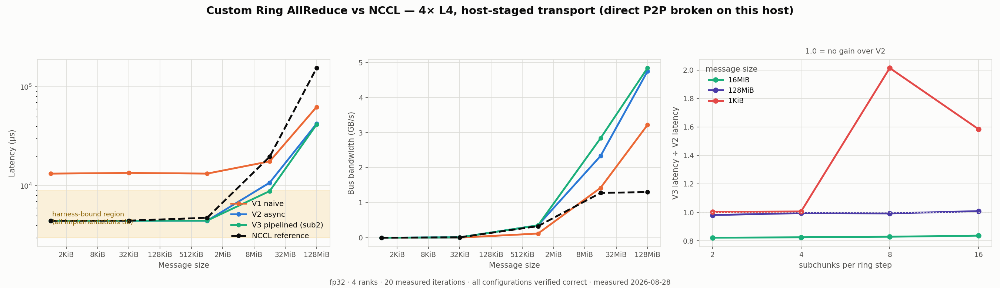

# Phase 6 — Simplified Ring AllReduce

Status: **completed**
Experiment ID: `p6-ring-allreduce-20260828T164556Z-911ccf0`
Date (UTC): 2026-08-28 · Repo commit: `911ccf0`
Implementation: [`src/ring_allreduce/ring_allreduce.cu`](../../src/ring_allreduce/ring_allreduce.cu)

> **Superseded in part.** [Phase 7A](p7a-harness-validation.md) profiled this
> experiment and found that the "~4.4 ms harness floor" claimed in section 7 was
> a property of the Phase 6 *host*, not of the harness, which costs ~27 us.
> Section 7, the small-message rankings, the V2->V3 16 MiB gain and the
> magnitude of the NCCL comparison are corrected there. This report is preserved
> unedited as the record of what was measured and concluded at the time; read it
> together with the Phase 7A reconciliation table.

> All numbers are **measured**. Every configuration passed a correctness check
> against an independently computed oracle **before** it was timed; nothing that
> failed was timed at all. Two findings in this report are negative and are
> reported as prominently as the positive ones.

---

## 1. The algorithm

AllReduce(SUM) over N ranks, built from two ring phases over a tensor split
into N equal chunks.

```text
             ReduceScatter (N-1 steps)              AllGather (N-1 steps)
   rank0  ┌─c0─┐                              each rank ends owning ONE
   rank1  │ c1 │   each step: send one chunk   fully-reduced chunk, then
   rank2  │ c2 │   to next, reduce the chunk   forwards it around the ring
   rank3  └─c3─┘   received from prev          until everyone has all N

   ring:  0 ──▶ 1 ──▶ 2 ──▶ 3 ──┐
          ▲                      │
          └──────────────────────┘
```

**Chunk schedule** (rank index `r`, step `s`):

| phase | sends chunk | receives chunk |
|-------|-------------|----------------|
| ReduceScatter | `(r - s + N) % N` | `(r - s - 1 + N) % N` |
| AllGather | `(r - s + 1 + N) % N` | `(r - s + N) % N` |

Worked example, N = 4, rank 0:

```text
RS  s=0: send c0, recv c3 → reduce into c3
    s=1: send c3, recv c2
    s=2: send c2, recv c1   ← rank 0 now owns the FINAL c1
AG  s=0: send c1, recv c0
    s=1: send c0, recv c3
    s=2: send c3, recv c2   ← rank 0 holds c0..c3, all final
```

**Invariant after ReduceScatter:** rank `r` owns the finished chunk `(r+1) % N`.

### Communication volume — derived, then verified

Each of the `N-1` steps in a phase moves exactly one chunk, `M/N` bytes, per
rank. So per rank:

```
ReduceScatter  = (N-1)/N · M
AllGather      = (N-1)/N · M
Ring AllReduce = 2(N-1)/N · M
```

That `2(N-1)/N` is exactly the bus-bandwidth correction factor used for
AllReduce since Phase 1 — the factor is not a convention, it is the ring's data
movement. The implementation **counts the bytes it actually copies**, so the
prediction is checked rather than asserted:

| size | bytes moved per rank | predicted `2(N-1)/N·M` | |
|-----:|---------------------:|----------------------:|---|
| 1 KiB | 1 536 | 1 536 | exact |
| 32 KiB | 49 152 | 49 152 | exact |
| 1 MiB | 1 572 864 | 1 572 864 | exact |
| 16 MiB | 25 165 824 | 25 165 824 | exact |
| 128 MiB | 201 326 592 | 201 326 592 | exact |

---

## 2. Hardware, topology and a transport problem

| Field | Value |
|-------|-------|
| Pod | `vuim7ep2xeapu5`, RunPod SECURE, US-MO-2 |
| GPU | NVIDIA L4 × 4, sm_89, PCIe Gen4 ×16 |
| **Price** | **$0.49/GPU/hr → $1.96/hour** (under the $3/hr threshold → autonomous) |
| CUDA | 12.8 · driver 570.195.03 |
| NCCL | 2.25.1+cuda12.8 (reference only) |

All four GPUs sit on NUMA node 1; every GPU pair reports `NODE` in
`nvidia-smi topo -m`. `cudaDeviceCanAccessPeer` returns **1 for all 12 ordered
pairs**.

### The capability bit lies on this host

**OBSERVATION.** With peer access enabled, a `cudaMemcpyPeer` between any two
of these GPUs returns `cudaSuccess` and delivers **NaN**. Enabling peer access
also corrupts a plain `cudaMemcpy(..., cudaMemcpyDeviceToDevice)` on the same
pair. With peer access disabled, both copies are correct.

```text
peer access DISABLED  -> 7.0 7.0 7.0 7.0   CORRECT
peer access ENABLED   -> -nan -nan -nan    WRONG
cudaMemcpy D2D        -> -nan -nan -nan    WRONG   (after enabling)
```

**OBSERVATION.** NCCL independently reaches the same conclusion on this host:
`Check P2P Type intraNodeP2pSupport 0` and every channel runs
`via SHM/direct/direct`.

**CONCLUSION.** `cudaDeviceCanAccessPeer` answers *"is peer access permitted"*,
not *"do peer transfers deliver the bytes"*. A first version of this code
trusted the capability bit and produced silently wrong results with no error
returned by any API. The implementation now runs a **functional peer test** — a
known pattern copied and read back — on every candidate ring edge:

```text
# functional peer test on the identity ring (capability bit is not enough):
#   dev0 -> dev1 : canAccessPeer=yes  transfers_correct=NO
#   dev1 -> dev2 : canAccessPeer=yes  transfers_correct=NO
#   dev2 -> dev3 : canAccessPeer=yes  transfers_correct=NO
#   dev3 -> dev0 : canAccessPeer=yes  transfers_correct=NO
# NO ring permutation of 4 GPUs has WORKING direct peer access
# refusing to run: pass --allow-host-staged to measure the
# host-staged transport explicitly, or use fewer GPUs.
```

The binary **refuses to run** rather than fabricate a P2P result. Everything
below was therefore measured in **explicitly named `host-staged` mode**, where
peer access stays disabled and `cudaMemcpyPeer` uses the driver's
device→host→device path. **No result in this report is a direct-P2P result.**

---

## 3. Correctness

Deterministic input makes the answer independently computable:

```
value(rank, j) = (rank + 1) · ((j mod 8) + 1)
sum over ranks = ((j mod 8) + 1) · N(N+1)/2
```

For N = 4 that is `((j mod 8) + 1) · 10` — a small integer, exactly
representable in fp32, so the oracle carries no rounding slack. **Every element
of every GPU's buffer** is checked.

| | |
|---|---|
| Rows | **35** (5 sizes × 7 configurations) |
| `value_kind` | all `measured` |
| Mismatches | **0** |
| Max absolute error | **0.000000** |
| Schema validation | pass |

Correctness gated timing throughout: an implementation that failed was never
timed, and its latency was written as `-1` rather than omitted.

---

## 4. The three versions

### V1 — naive reference (kept, not deleted)

Blocking `cudaMemcpyPeer`, a separate reduction kernel, and a **full device
barrier at every phase boundary**: all ranks copy, everyone waits, all ranks
reduce, everyone waits. Clear, deterministic, and slow by construction. It is
the baseline and it is also what proved the schedule correct when the
asynchronous versions did not.

### V2 — asynchronous

Per-device copy and compute streams, `cudaMemcpyPeerAsync`, and CUDA events.
The dependencies that actually exist:

| # | dependency | expressed as |
|---|------------|--------------|
| (a) | rank r's copy at step s follows rank r's reduce at step s-1 (it sends the chunk that reduce just finished) | same-rank event `calcDone[r][s-1]` |
| (b) | rank r+1's reduce at step s follows rank r's copy at step s (it consumes what that copy wrote) | cross-device event `copyDone[r][s]` |
| (c) | a copy must not overwrite staging that a reduce is still reading (WAR) | **per-step staging buffers** — see below |

### V3 — pipelined

V2 plus subchunking: each chunk is split into `sub` pieces so the receiver can
reduce subchunk *k* while subchunk *k+1* is still in flight.

---

## 5. A race that V1 could not have found

**OBSERVATION.** The first V2/V3 used **parity double-buffering** for the
receive staging (`stage[s & 1]`). V1 was correct at every size; V2 and V3 were
wrong at every size, and the mismatch count **varied between runs of the same
input** — 262 144, then 322 304, then 294 912 at 1 MiB.

**INTERPRETATION.** Varying wrongness with a fixed input is the signature of a
race, not of a schedule error. Parity separates *adjacent* steps, but steps
`s-1` and `s+1` share a parity and therefore share a buffer. Rank r's copy at
step `s+1` writes the same staging that rank `next(r)`'s reduce at step `s-1`
may still be reading — and nothing orders them: the event chain runs *backwards*
around the ring (r's copy ← r's reduce ← prev(r)'s copy ← …) and never reaches
forward to `next(r)`.

**FIX.** One staging buffer per ReduceScatter step. This removes the hazard
structurally rather than paying for another synchronisation edge, at a cost of
`(N-1) × chunk` extra bytes per GPU. After the fix: **0 mismatches everywhere**.

**What this teaches.** The naive version was not wasted work. Keeping a
barrier-heavy V1 that is correct by construction is what made it possible to
localise the bug to the synchronisation, not the schedule — the two versions
share the identical chunk arithmetic.

---

## 6. Results



Latency (µs), 4 ranks, host-staged, mean of 20 iterations:

| size | V1 naive | V2 async | V3 sub2 | V3 sub4 | V3 sub8 | V3 sub16 | NCCL ref |
|-----:|---------:|---------:|--------:|--------:|--------:|---------:|---------:|
| 1 KiB | 13 293 | 4 441 | 4 450 | 4 467 | 8 943 | 7 039 | 4 443 |
| 32 KiB | 13 519 | 4 441 | 4 456 | 4 473 | 4 513 | 4 592 | 4 459 |
| 1 MiB | 13 300 | 4 445 | 4 463 | 4 473 | 4 507 | 5 267 | 4 768 |
| 16 MiB | 17 679 | 10 785 | **8 860** | 8 893 | 8 935 | 9 018 | 19 688 |
| 128 MiB | 62 565 | 42 407 | **41 580** | 42 175 | 42 082 | 42 762 | 154 520 |

Bus bandwidth (GB/s):

| size | V1 | V2 | V3 sub2 | NCCL ref |
|-----:|---:|---:|--------:|---------:|
| 16 MiB | 1.42 | 2.33 | **2.84** | 1.28 |
| 128 MiB | 3.22 | 4.75 | **4.84** | 1.30 |

### Speedups

| size | V1 → V2 | V2 → best V3 |
|-----:|--------:|-------------:|
| 1 KiB | 2.99× | 1.00× |
| 32 KiB | 3.04× | 1.00× |
| 1 MiB | 2.99× | 1.00× |
| 16 MiB | 1.64× | **1.22×** |
| 128 MiB | 1.48× | 1.02× |

---

## 7. The small-message numbers are harness-bound, not implementation-bound

**OBSERVATION.** At 1 KiB, 32 KiB and 1 MiB, five of the seven configurations —
including NCCL — land between 4 441 and 4 473 µs, a spread under 1%. Seven
structurally different implementations cannot genuinely agree that closely.

**OBSERVATION.** Phase 5 measured the *same* collective (NCCL AllReduce, 4 × L4,
32 KiB) at **35.4 µs** using nccl-tests. This harness reports **4 458 µs** for
it — a 4 423 µs offset.

**CONCLUSION.** The Phase 6 harness carries a fixed per-iteration cost of
roughly **4.4 ms** that dominates everything below a few MiB. **The
small-message rows cannot be used to rank implementations** and are not used
that way anywhere in this report.

**INTERPRETATION, not measured.** The likely sources are the per-iteration
`cudaStreamSynchronize`/`cudaDeviceSynchronize` inside the timed body and the
~36 `cudaSetDevice` calls a single custom AllReduce performs. Which dominates
was **not** isolated — that would need a separate experiment.

This is a limitation of my measurement, found by cross-checking against an
earlier phase rather than by inspecting the code.

---

## 8. What the versions teach

### V1 → V2: synchronisation, measured

**OBSERVATION.** 1.48×–3.04×, largest at small sizes.

**INTERPRETATION.** V1 pays `2(N-1) = 6` full 4-GPU device barriers per
AllReduce. At small messages the barriers *are* the runtime, which is why the
gain is ~3× there and shrinks to 1.48× at 128 MiB where bytes dominate. The
large-message part of this comparison is above the harness floor and is sound;
the small-message part is contaminated by §7 and should be read as "removing
barriers helps a lot" rather than as a precise factor.

### V2 → V3: pipelining, with a visible cost floor

**OBSERVATION.** Subchunking helps only at 16 MiB (1.22×, sub2). At 128 MiB it
is 1.02×. At 1 KiB, sub8 and sub16 are **2.01× and 1.59× *slower* than V2**.

**INTERPRETATION.** This is the pipeline tradeoff the phase set out to expose,
and both ends of it appear:

- *too many subchunks* → one peer copy, one event record, one event wait and
  one kernel launch **per subchunk**; at 1 KiB the whole chunk is 64 floats, so
  the launches are pure overhead.
- *too few subchunks* → almost no overlap; V3 sub2 ≈ V2 at 128 MiB.

The 16 MiB point is where a chunk is large enough for overlap to be worth
anything but small enough that per-subchunk cost stays negligible.

---

## 9. NCCL comparison — with a large caveat

**OBSERVATION.** At 16 MiB and 128 MiB the custom ring is **faster** than NCCL
in this harness: 8 860 vs 19 688 µs (0.45×) and 41 580 vs 154 520 µs (0.27×).

**This is not a claim that the simplified ring beats NCCL.** Four reasons to
distrust it as a general statement:

1. **Direct P2P is broken on this host** (§2). NCCL fell back to its SHM
   protocol, which chunks aggressively for latency; my implementation issues a
   few large driver-staged copies. For pure bulk movement on a degraded
   transport the bulk path can win. On a host with working P2P — where NCCL
   uses direct peer writes and fused reduce-copy kernels — the comparison would
   very likely reverse.
2. **The harness adds cost (§7)**, and there is no reason to assume it loads
   NCCL and the custom versions equally.
3. **Phase 5 measured NCCL at 97 415 µs for 128 MiB** on a *different* 4 × L4
   host using nccl-tests, against 154 520 µs here. Different host, different
   harness — I cannot cleanly separate the two, so I do not.
4. NCCL's internal SHM protocol behaviour was **not** measured, only its
   reported transport choice.

**Hypothesised structural advantages of NCCL** — stated as hypotheses because
none was measured here: fused copy-and-reduce kernels (my V1–V3 always do a
separate copy then a separate kernel), GPU-side scheduling that avoids host
round-trips per step, multiple channels running concurrently over one link,
LL/LL128 protocols that carry synchronisation inline with data, and
topology-aware ring construction.

---

## 10. Bottlenecks, by evidence

| implementation | dominant cost | evidence |
|---|---|---|
| V1 | **synchronisation** | removing barriers alone gave 1.48×–3.04× |
| V2 | **copy bandwidth** at ≥16 MiB | bus bandwidth flattens at 4.75 GB/s; subchunking barely helps at 128 MiB |
| V3 (large sub) | **kernel-launch / event overhead** | sub8 and sub16 are 2.01× and 1.59× *slower* at 1 KiB |
| all, ≤1 MiB | **harness fixed cost** | §7 — not attributable to any implementation |

Not measured, therefore not claimed: which specific API call produces the
harness floor; how NCCL's SHM protocol spends its time; what any of this would
look like with working P2P.

---

## 11. Limitations

- **Host-staged transport only.** Direct P2P was functionally broken on this
  host. Every number here is device→host→device. This is the single biggest
  limitation and it affects every comparison.
- **A ~4.4 ms harness floor** makes all results below a few MiB unusable for
  ranking (§7).
- **The NCCL comparison is not a general result** (§9).
- fp32 and SUM only; 4 ranks; one node; one host.
- Single measurement per configuration — no repeats, so no run-to-run variance
  is reported. Earlier phases used 3 repeats; this one did not, which is a gap.
- V3 pipelines only the ReduceScatter phase; AllGather still moves whole chunks.
- No profiler was used; the bottleneck attributions in §10 rest on the
  version-to-version deltas, not on a timeline.

---

## 12. Cost and cleanup

| Item | Value |
|------|-------|
| Pod `vuim7ep2xeapu5` | ≈ 35 min @ $1.96/hr |
| **Cost (derived)** | **≈ $1.14** |

Per the Phase 5 lesson, completeness was confirmed **before** deletion: V1, V2,
V3 all implemented and correct, all five sizes benchmarked, the NCCL reference
collected, the P2P functional diagnostic captured, and NCCL's transport choice
probed — all GPU-only work done, then the pod was terminated.

**Cleanup verified.** `delete-pod` → 204; `list-pods` returned **0**. No network
volumes or other persistent paid resources. Parsing, plotting and this document
were produced locally after compute was released.

---

## 13. Next

Phase 7 (communication profiling) has **not** been started. The two most
valuable follow-ups from this phase are: repeat it on a host with **working
direct P2P**, which would make the NCCL comparison meaningful; and fix the
harness floor identified in §7, which would make the small-message regime
measurable at all.
