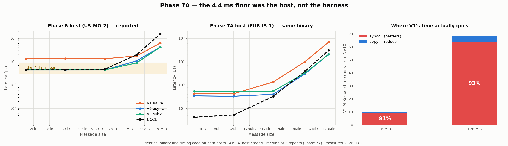

# Phase 7A — Profiling and Benchmark-Harness Validation

Status: **completed**
Experiment ID: `p7a-harness-validation-20260829T032840Z-64c7410`
Date (UTC): 2026-08-29 · Repo commit: `64c7410`
Investigates: [Phase 6](p6-ring-allreduce.md) §7

> This phase performs **no optimization**. It determines what the Phase 6
> benchmark was measuring, and reconciles which Phase 6 conclusions survive.
> **One headline Phase 6 conclusion is invalidated by this work** and is
> corrected below rather than quietly edited in place.

---

## 1. The question

Phase 6 reported a ~4.4 ms floor for every implementation including NCCL, and
attributed it to *"a fixed per-iteration cost in the Phase 6 harness"*. Phase 5
had measured the same NCCL collective at 35 µs with nccl-tests. Before any
further work, that discrepancy had to be explained.

**It was not the harness.**

---

## 2. Setup

| Field | Value |
|-------|-------|
| Pod | `vyg6gwizzohzqg`, RunPod SECURE, **EUR-IS-1** |
| GPU | NVIDIA L4 × 4, sm_89, driver 550.127.05, CUDA 12.8 |
| Topology | all pairs `SYS` (Phase 6's host was all `NODE` — this one is *worse*) |
| P2P | capability yes, **functional test NO** on every edge → `host-staged`, same as Phase 6 |
| Price | $0.49/GPU/hr → **$1.96/hour** (under the $3/hr threshold) |
| Runtime / cost | ≈ 12 min → **≈ $0.39** |
| Profiler | Nsight Systems 2024.2.3 (installed via `cuda-nsight-systems-12-5`) |

The binary, the timing code and the NCCL version are **identical** to Phase 6.
Only the host differs.

---

## 3. Root cause of the ~4.4 ms floor

### 3.1 Harness calibration — every component measured

`src/ring_allreduce/harness_calibration.cu` measures each harness component
using the **same host-clock-plus-barrier scheme** the Phase 6 harness uses, so
the numbers compose:

| case | per iteration |
|------|--------------:|
| A. empty host body (chrono + loop) | 0.000 µs |
| C1. `cudaSetDevice` ×1 | **0.184 µs** |
| C2. `cudaSetDevice` cycling all 4 GPUs | **0.727 µs** |
| D1. `cudaDeviceSynchronize` ×1 (idle) | 0.709 µs |
| D2. `syncAll()` — the Phase 6 barrier | **2.985 µs** |
| D3. `cudaStreamSynchronize` all GPUs | 2.381 µs |
| E1. empty kernel launch | 2.704 µs |
| F1. event record + cross-device wait, all GPUs | 4.460 µs |
| G1. one `cudaMemcpyPeer`, 4 MiB chunk | 441.5 µs |
| G3. reduce kernel over that chunk + sync | 12.0 µs |
| **H1. NCCL AllReduce 1 KiB — Phase 6 body verbatim** | **64.9 µs** |
| H2. same, without per-rank `cudaSetDevice` | 62.7 µs |
| H3. same, 20 enqueued + 1 sync (nccl-tests pattern) | 37.4 µs |

**OBSERVATION.** Every host-side component is single-digit microseconds. The
complete Phase 6 NCCL body — 8 × `cudaSetDevice` + `ncclGroup` + 4 ×
`cudaStreamSynchronize` — costs **64.9 µs**, not 4 443 µs.

**OBSERVATION.** H1 − H2 = 2.2 µs isolates `cudaSetDevice`: negligible.
H1 − H3 = 27.5 µs isolates per-iteration synchronisation: real, but 160× too
small to explain the floor.

### 3.2 The decisive experiment: same binary, different host

| NCCL AllReduce, 4 × L4, host-staged | 1 KiB | 32 KiB |
|---|---:|---:|
| Phase 6 host (US-MO-2) | **4 443 µs** | 4 459 µs |
| Phase 7A host (EUR-IS-1), *identical binary* | **42 µs** | 53 µs |
| Phase 5, nccl-tests, third host | — | 35 µs |

**CONCLUSION.** The floor does not follow the code. It followed the machine.
The Phase 6 attribution — "a fixed per-iteration cost in the harness" — is
**wrong**. The harness costs ≈ 27 µs of avoidable synchronisation, three orders
of magnitude short of what Phase 6 blamed on it.

**LIMITATION — stated plainly.** The Phase 6 pod is terminated, so the actual
cause on *that* host cannot be determined post hoc. Candidates, none verified:
a contended or degraded host; or lasting driver-state damage from the P2P
functional probe, which enables and disables peer access ~24 times on a machine
where peer mappings are broken. This host ran the same probe without the floor,
so the probe alone is **not** sufficient to cause it.

---

## 4. Timing semantics — old and corrected

**They were already correct.** NVTX confirms it directly: in the small-message
trace `NCCL:ncclCommInitAll` takes **547.9 ms** while the entire
`timed-region` is **0.74 ms**. Communicator creation is nowhere near the timed
region.

| component | in the Phase 6 timed region? | evidence |
|---|---|---|
| allocation | no | `alloc` NVTX range is outside `timed-region` |
| stream / event creation | no | inside `ringInit`, before timing |
| **NCCL communicator setup** | **no** | `ncclCommInitAll` 547.9 ms vs `timed-region` 0.74 ms |
| warmup | no | separate `warmup` NVTX range |
| correctness validation | no | separate `validate` range, before timing |
| device switching | **yes** | 0.18 µs each — intended, negligible |
| host synchronisation | **yes** | 2.4–3.0 µs per barrier — intended |

**Corrected semantics (unchanged, now documented):** one collective measured
from a quiesced state to a quiesced state, averaged over `iters`. That barrier
is *semantically required* by the custom ring — consecutive iterations reuse the
same staging buffers, so back-to-back enqueueing without a barrier would race.
Removing it for NCCL only would make the comparison unfair.

**The only harness change made** is `--repeats`, so variance can be reported.
Phase 6 had none. No structural correction was warranted, because measurement
showed none was needed.

---

## 5. Timeline findings

Nsight Systems, NVTX ranges, 4 GPUs, host-staged. **Profiling runs are not used
as performance measurements**; the reported numbers in §6 come from a binary
built without `-DUSE_NVTX=1`.

### 5.1 V1 — synchronisation is 91–93% of the runtime

| | 16 MiB | 128 MiB |
|---|---:|---:|
| `v1-allreduce` (avg per call) | 10.20 ms | 68.65 ms |
| `v1-sync` total ÷ calls | **9.28 ms** | **63.81 ms** |
| **share spent in barriers** | **91%** | **93%** |
| `v1-reducescatter` | 5.19 ms | 34.90 ms |
| `v1-allgather` | 5.01 ms | 33.75 ms |

`cudaDeviceSynchronize` is the single largest CUDA API cost in both traces —
50.7% at 16 MiB, 53.3% at 128 MiB, 571 calls.

### 5.2 V2 / V3 — the phase ranges measure *enqueue*, not execution

| | 16 MiB | 128 MiB |
|---|---:|---:|
| `v2-allreduce` | 3.07 ms | 20.99 ms |
| `v2-final-sync` | 2.19 ms (71%) | 16.36 ms (78%) |
| `v3-allreduce` | 4.16 ms | 21.89 ms |
| `v3-reducescatter` (enqueue) | 1.86 ms | 3.60 ms |
| `v3-allgather` (enqueue) | 0.38 ms | 2.26 ms |
| `v3-final-sync` | 1.91 ms | 16.02 ms |

**INTERPRETATION.** For the asynchronous versions the host returns from the
enqueue loop long before the GPU finishes, so the work is *observed* in the
final barrier. The phase ranges therefore measure host enqueue cost, and the
final-sync range measures everything that was outstanding. This is a property
of host-side NVTX on async work, not a finding about the algorithm.

**V2 → V3 at 128 MiB:** V3's ReduceScatter enqueue is **1.5× longer** than V2's
(3.60 vs 2.39 ms) — more copies, more event records, more launches — while the
final sync is essentially unchanged (16.02 vs 16.36 ms). Subchunking added
control work without shortening the critical path.

### 5.3 NCCL

**Kernel name is direct evidence of algorithm and protocol** — it is not
inferred:

```
ncclDevKernel_AllReduce_Sum_f32_RING_LL
```

at **both** 1 KiB and 128 MiB. NCCL chose **Ring + LL** on this host at both
ends of the size range. One kernel instance per rank per collective; no
host-side round trip per ring step.

Also visible: `cudaHostRegister` is 24–28% of CUDA API time (32 calls, ~18 ms
each) — the driver pinning host staging buffers for the host-staged path. It
happens during allocation, **not** per iteration.

---

## 6. Corrected results



Latency (µs), median of **3 repeats**, spread in parentheses:

| size | V1 naive | V2 async | V3 sub2 | V3 sub16 | NCCL |
|-----:|---------:|---------:|--------:|---------:|-----:|
| 1 KiB | 427 (53%) | 345 (58%) | 539 (50%) | 3 026 (6%) | **42 (3%)** |
| 32 KiB | 427 (1%) | 333 (1%) | 519 (4%) | 3 012 (6%) | **53 (2%)** |
| 1 MiB | 1 350 (1%) | **403 (1%)** | 547 (2%) | 3 005 (2%) | 328 (2%) |
| 16 MiB | 10 002 (0%) | **3 000 (0%)** | 3 229 (0%) | 4 215 (1%) | 3 853 (1%) |
| 128 MiB | 68 490 (0%) | 20 880 (0%) | **20 575 (0%)** | 23 702 (0%) | 30 523 (0%) |

| size | V1→V2 | V2→best V3 | best custom ÷ NCCL |
|-----:|------:|-----------:|-------------------:|
| 1 KiB | 1.24× | 0.64× | **8.18×** (NCCL far ahead) |
| 32 KiB | 1.29× | 0.64× | **6.29×** |
| 1 MiB | 3.35× | 0.74× | 1.23× |
| 16 MiB | 3.33× | 0.93× | 0.78× |
| 128 MiB | 3.28× | 1.01× | 0.67× |

**Variance.** Median spread across 3 repeats is 0.6–3.0%. The exception is
1 KiB, where V1/V2/V3-sub2 show up to 53–58% — a first-repeat effect that does
not appear at any other size. Small-message numbers here carry real uncertainty
and are reported with it.

---

## 7. Reconciliation with Phase 6

| Phase 6 conclusion | Verdict | Why |
|---|---|---|
| Per-rank movement = `2(N-1)/N·M`, verified exactly | **STILL VALID** | reconfirmed at all five sizes |
| V1 correct against an exact fp32 oracle | **STILL VALID** | 105 rows, 0 mismatches |
| Parity double-buffering caused a WAR race; per-step staging fixes it | **STILL VALID** | zero mismatches across two hosts |
| `cudaDeviceCanAccessPeer` is not a functional test | **STILL VALID** | reproduced independently on a *second* host |
| Many subchunks are harmful at small messages | **STILL VALID** | sub16 = 3 026 µs vs V2 345 µs at 1 KiB |
| **"~4.4 ms fixed *harness* cost"** | **INVALIDATED** | harness costs ≈ 27 µs; the floor followed the host, not the code (§3) |
| **"small-message rows unusable for ranking"** | **REVISED** | unusable *on that host*; here they rank cleanly and NCCL wins by 6–8× |
| V1→V2 = 1.48×–3.04× | **REVISED** | 3.28×–3.35× at ≥1 MiB, 1.24×–1.29× below; and now *explained*: 91–93% of V1 is barriers |
| **V2→V3 = 1.22× at 16 MiB** | **INVALIDATED** | does not reproduce — V3 sub2 is **0.93×** (slower) at 16 MiB here |
| custom faster than NCCL at ≥16 MiB | **REVISED** | direction holds, magnitude much smaller: 0.67–0.78× vs the reported 0.27–0.45× |
| **"custom ≈ NCCL at small sizes"** | **INVALIDATED** | NCCL is **6–8× faster** at 1–32 KiB |

The Phase 6 report is **left intact**; this document is the correction of record.

---

## 8. Answers to the research questions

1. **What causes the ~4.4 ms floor?** Not the harness — measured at ≈ 27 µs.
   It was specific to the Phase 6 host. The exact cause on that machine cannot
   be recovered; the pod is gone.
2. **Why did V2 beat V1?** Confirmed by timeline: **91–93% of V1's runtime is
   `syncAll` barriers.** Removing them is the entire speedup, and the corrected
   factor is 3.3× at ≥1 MiB.
3. **What explains V3's 16 MiB gain?** **Nothing — it does not reproduce.**
   V3 is 0.93× (slower) than V2 at 16 MiB on this host.
4. **Why little V3 benefit at 128 MiB?** V3's enqueue is 1.5× longer than V2's
   while the critical path is unchanged: on a host-staged path the copies are
   already serialised through driver-pinned host memory, so subchunking adds
   launches without creating concurrency.
5. **What was an artifact?** The floor, and every conclusion that rested on it —
   the small-message "tie" and the claim that those rows could not be ranked.
6. **What survives?** Everything about correctness, the race diagnosis, the
   communication-volume derivation, the P2P capability finding, and the
   direction (not magnitude) of V1→V2 and of the large-message NCCL comparison.

---

## 9. Limitations

- **The Phase 6 host cannot be re-measured.** The root cause there is
  bracketed, not identified.
- **Three different hosts** across Phases 5, 6 and 7A, all 4 × L4 but with
  different topologies (`NODE`, `NODE`, `SYS`). Cross-phase absolute numbers
  are not comparable; only same-host comparisons are.
- **Host-staged transport only** — direct P2P was functionally broken on this
  host too. No direct-P2P result exists anywhere in Phases 6 or 7A.
- NVTX host ranges measure **enqueue** for async work (§5.2); GPU-side
  attribution comes from the CUDA API and kernel summaries, not from those
  ranges.
- 1 KiB variance reaches 53–58%; those rows are weak.
- Nsight Compute was not used; no per-kernel occupancy or memory analysis.
- No optimization was attempted, by design.

---

## 10. Cleanup

Completeness was confirmed before deletion: calibration suite, three NVTX
traces with extracted statistics, and the 3-repeat compact matrix — all
GPU-dependent work finished, then the pod was terminated. `delete-pod` → 204;
`list-pods` returned **0**. Large `.nsys-rep` traces were left on the pod and
only the extracted CSV summaries were retained, per the project rule against
committing large binary traces.

---

## 11. Next

Phase 7B (communication/computation overlap) has **not** been started. The most
useful preparation for it is already done here: a calibration suite that can
tell harness cost from real cost, and NVTX instrumentation that makes the
enqueue-versus-execution distinction visible.
