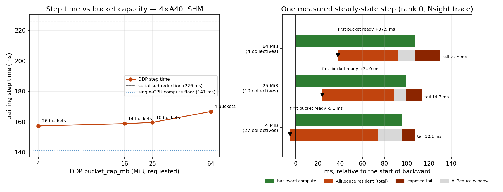

# Phase 9 — Real PyTorch DDP Training Workload Validation

Status: **completed**
Experiment ID: `p9-ddp-training-20260829T1351Z-cfbb1ff`
Date (UTC): 2026-08-29 · Repo commit: `cfbb1ff`
Builds on: [Phase 8](p8-contention.md) · [Phase 7B](p7b-overlap.md)

> Phases 7B and 8 measured overlap and contention with a synthetic stand-in for
> compute. Phase 9 asks whether those results survive contact with a real
> training step: a real autograd backward, real gradients, and DDP's own
> reducer. Nothing here simulates backward.
>
> The optimisation target is **end-to-end training step time**. Overlap
> percentage is a diagnostic and is reported next to step time, never instead
> of it.

---

## 1. Setup, topology and transport

| Field | Value |
|-------|-------|
| Pod | `2ikkqpuew36s3q`, RunPod SECURE, **CA-MTL-1** |
| GPU | NVIDIA A40 × 4, sm_86, driver 580.x, CUDA 12.8 |
| CPU | Intel Xeon Gold 6342 @ 2.80 GHz, 96 threads, 2 NUMA nodes |
| PyTorch | 2.8.0+cu128 · NCCL runtime **2.27.3** · BF16 supported |
| **Transport** | **`SHM/direct` on all 8 ring links**, functionally validated (§1.2) |
| Network | none — single node, 4 GPUs, 4 processes (`torchrun`) |
| **Price / cost** | **$1.76/hour** × ≈ 65 min ≈ **$1.90** — see §12 |

Topology differs from the Phase 8 host: two same-switch pairs rather than one
isolated GPU.

```
        GPU0  GPU1  GPU2  GPU3   CPU Affinity     NUMA
GPU0     X    PIX   SYS   SYS    0-23,48-71       0
GPU1    PIX    X    SYS   SYS    0-23,48-71       0
GPU2    SYS   SYS    X    PIX    24-47,72-95      1
GPU3    SYS   SYS   PIX    X     24-47,72-95      1
```

### 1.1 The P2P deadlock reproduces on a third host

Left to choose, NCCL builds a mixed ring — `P2P/CUMEM` across each `PIX` pair,
`SHM/direct` across the two `SYS` hops:

```
Channel 00/0 : 0[0] -> 1[1] via P2P/CUMEM
Channel 00   : 1[1] -> 2[2] via SHM/direct/direct
Channel 00/0 : 2[2] -> 3[3] via P2P/CUMEM
Channel 00   : 3[3] -> 0[0] via SHM/direct/direct
Connected all rings, use ring PXN 0 GDR 1
```

Initialisation completes; the first collective never returns (`rc=124` at the
180 s bound, all four GPUs pinned at 100 %, no correctness line ever printed).

**OBSERVATION.** This is now the **third distinct host** to show it — Phase 8's
two pods in EU-SE-1 and this one in CA-MTL-1, and here with a different NCCL
(2.27.3 vs 2.25.1) and a different topology (two `PIX` pairs vs one `PIX`, one
`PXB`). It is not a one-off machine fault.

**INTERPRETATION.** The common factor is a ring that mixes a working P2P hop
with a SHM hop across a NUMA boundary on A40 under a container tenant. The
capability bit says yes in every case. Phases 6, 8 and 9 have now each been
misled by it in a different way — wrong data, a hang, and a hang.

### 1.2 Transport is functionally validated, not merely observed

With `NCCL_P2P_DISABLE=1` every ring link is `SHM/direct` and the run completes.
Crucially, the check is not "it finished":

```
# CORRECTNESS loss_finite=True grads_finite=True param_sync_max_abs_diff=0.000e+00
```

`param_sync_max_abs_diff` is the maximum `|p_rank − p_rank0|` over every
parameter after real gradient AllReduces. Silent corruption on any hop — the
Phase 6 failure mode — would make it non-zero. It is exactly 0.0 for all four
bucket configurations. **This is what licenses calling the transport good.**

**LIMITATION.** Everything below is measured on **SHM**, a host-memory
transport. This is the phase's largest limitation and is restated in §13.

---

## 2. Model and workload

A compact GPT written for this phase (`src/ddp/model.py`) — embedding,
positional embedding, causal self-attention via SDPA, GELU MLP, LayerNorm,
untied output projection, cross-entropy. No external framework.

| Field | Value |
|-------|-------|
| Layers / heads / d_model | 8 / 12 / 768 |
| Vocab / sequence length | 16 384 / 1024 |
| **Parameters** | **82 601 472** |
| **Gradient volume per step per rank** | **330 405 888 B = 315.09 MiB** (float32) |
| Precision | BF16 autocast, float32 master weights and gradients |
| Batch per GPU / tokens per step (4 GPU) | 16 / 65 536 |
| Optimizer | AdamW (fused), lr 3e-4, β (0.9, 0.95), wd 0.1 |
| Dropout | omitted entirely — not set to 0.0, so no RNG draw varies |
| Data | 4 pre-generated synthetic batches resident on the GPU; no I/O in the timed path |
| Peak memory | 7.53 GiB single-GPU, 7.84–8.14 GiB DDP (of 48 GiB) |

Calibration compared three shapes before committing; this one was chosen
because its backward (87 ms) is close to its gradient AllReduce (≈ 85 ms), the
regime where bucket effects are most visible, and because 315 MiB yields several
buckets at every capacity tested.

### 2.1 How the timings are taken

CUDA event pairs bracket forward / backward / optimizer and are **read only
after the measured window closes**, so no synchronisation is injected into the
region whose overlap is being measured.

In DDP mode `backward_ms` includes the gradient AllReduce tail, because DDP
joins its communication stream before `loss.backward()` returns. The
communication cost is therefore obtained by differencing against the same loop
run inside `model.no_sync()`, which suppresses the reducer entirely:

```
sync_cost = backward(reducer on) − backward(reducer suppressed)
```

**This is deliberately not called "the tail".** Phases 7B and 8 showed that a
resident collective also slows concurrent compute, so `sync_cost` bundles the
genuine post-backward tail with that interference. §6 separates the two using
the trace.

Sanity check: `backward` with the reducer suppressed is **87.30–87.70 ms**
across all four configurations, against **87.35 ms** for the single-GPU run —
the same backward, as it should be.

---

## 3. Single-GPU reference

12 warmup steps, then 3 repeats × 30 measured steps.

| step | forward | backward | optimizer | tokens/s |
|-----:|--------:|---------:|----------:|---------:|
| **141.12 ms** | 46.65 | 87.35 | 7.13 | **116 067** |

This is the compute floor: what the step costs with no communication at all.

---

## 4. DDP bucket-size matrix

`bucket_cap_mb` ∈ {4, 16, 25, 64}, everything else held constant. 12 warmup
steps (so DDP's bucket rebuild completes before measurement), 3 repeats × 30
steps, medians shown. Process-group init and model construction are outside the
timed region.

| bucket cap | collectives / step | step (ms) | spread | fwd | bwd | bwd (no-sync) | **sync cost** | opt | tokens/s |
|-----------:|-------------------:|----------:|-------:|----:|----:|--------------:|--------------:|----:|---------:|
| **4 MiB** | **26** | **157.26** | 0.07 | 46.36 | 103.93 | 87.30 | **16.63** | 6.99 | **416 414** |
| 16 MiB | 14 | 158.81 | 0.13 | 46.44 | 105.49 | 87.57 | 17.92 | 6.99 | 412 627 |
| 25 MiB | 10 | 159.60 | 0.47 | 46.52 | 105.98 | 87.68 | 18.30 | 7.13 | 410 433 |
| 64 MiB | 4 | 166.80 | 0.40 | 46.46 | 113.43 | 87.70 | **25.73** | 6.87 | 392 784 |



### 4.1 The requested capacity is not the collective size

**OBSERVATION.** DDP's own `rebuilt_bucket_sizes` show every configuration
overshooting its cap:

| requested cap | buckets | min | median | max | total |
|--------------:|--------:|----:|-------:|----:|------:|
| 4 MiB | 26 | 9.00 MiB | 9.01 MiB | **51.01 MiB** | 315.1 MiB |
| 16 MiB | 14 | 18.01 | 18.01 | **51.01** | 315.1 |
| 25 MiB | 10 | 27.01 | 27.01 | **51.01** | 315.1 |
| 64 MiB | 4 | 65.28 | 69.02 | **111.78** | 315.1 |

Two things are going on.

1. A bucket is filled until the *next* parameter would exceed the cap, and then
   that parameter is added anyway — so the typical bucket runs ~8 % over
   (27.01 MiB for a 25 MiB cap).
2. **A bucket can never be smaller than its largest single parameter.** Every
   configuration contains a bucket of exactly **50 331 648 B = 16384 × 768 × 4**
   — the output projection weight. With the tied-size embedding beside it,
   ~100 MiB of the 315 MiB gradient volume lives in two indivisible tensors.

**INTERPRETATION.** No `bucket_cap_mb` below ~48 MiB can do anything about
almost a third of this model's gradient traffic. That is a large part of why
4, 16 and 25 MiB land within 1.5 % of each other: they differ only in how they
chop up the *other* two thirds. A practitioner tuning `bucket_cap_mb` on a
model with a large vocabulary is tuning a smaller lever than the parameter name
suggests.

### 4.2 Cross-check against DDP's own instrumentation

`_get_ddp_logging_data()` is independent of my CUDA events and agrees on the
direction:

| bucket cap | fwd compute | bwd compute | bwd comm | comm overlapped | overlapped share |
|-----------:|------------:|------------:|---------:|----------------:|-----------------:|
| 4 MiB | 71.4 ms | 94.2 | 82.3 | 66.4 | **81 %** |
| 16 MiB | 76.3 | 94.2 | 86.1 | 66.2 | 77 % |
| 25 MiB | 69.6 | 93.6 | 94.6 | 65.7 | 69 % |
| 64 MiB | 78.8 | 92.6 | 87.7 | 60.9 | 69 % |

---

## 5. Is there a plateau?

**Method.** The three repeats inside one process share a warm communicator, a
warm allocator and one memory layout, so their spread understates run-to-run
noise. Nine additional **independent `torchrun` launches** were run for this
question alone.

| bucket cap | independent launches | median step | spread |
|-----------:|---------------------:|------------:|-------:|
| 4 MiB | 3 | 157.06 ms | 0.39 |
| 25 MiB | 3 | 159.54 ms | 0.11 |
| 64 MiB | 3 | 166.48 ms | 0.21 |

Noise floor = **0.39 ms**, the largest across-launch spread.

| bucket cap | Δ vs best | resolvable above noise? |
|-----------:|----------:|:------------------------|
| 4 MiB | +0.00 ms (0.00 %) | reference |
| 16 MiB | +1.55 ms (+0.99 %) | yes (4× noise) |
| 25 MiB | +2.35 ms (+1.49 %) | yes (6× noise) |
| 64 MiB | +9.54 ms (+6.07 %) | yes (24× noise) |

**OBSERVATION.** The ordering 4 < 16 < 25 < 64 MiB is monotone and **every gap
is statistically resolvable**. There is no flat plateau in the strict sense.

**CONCLUSION.** But "resolvable" is not "worth acting on". 4/16/25 MiB span
**1.5 %** of step time — a practically equivalent region where the choice
barely matters — while 64 MiB is **6.1 %** worse and does matter. The honest
description is *a shallow but real gradient with a cliff at the large end*, not
a plateau and not a sharp optimum. Phase 7B's plateau was not assumed here; it
was tested and came out slightly sharper than "plateau" implies.

---

## 6. Timeline evidence — what actually overlaps

Nsight Systems with NVTX, one steady-state step on rank 0, window bounded by
the *next* backward on the same rank so the following step's collectives cannot
contaminate the tail.

| bucket cap | collectives | **first AllReduce start** | NCCL resident during backward | **tail after backward** | total NCCL busy |
|-----------:|------------:|--------------------------:|------------------------------:|------------------------:|----------------:|
| 4 MiB | 27 | **−5.1 ms (−5.4 %)** | 79.3 ms (**83.3 %**) | **12.1 ms** | 96.5 ms |
| 25 MiB | 10 | **+24.0 ms (24.2 %)** | 64.7 ms (**65.2 %**) | **14.7 ms** | 79.4 ms |
| 64 MiB | 4 | **+37.9 ms (35.2 %)** | 54.2 ms (**50.4 %**) | **22.5 ms** | 76.8 ms |

**OBSERVATION 1.** DDP genuinely overlaps: a collective is resident for
50–83 % of backward, and the collective count from the trace (27 / 10 / 4 per
step) matches `rebuilt_bucket_sizes` exactly — collective count *is* bucket
count, measured on both sides rather than assumed.

**OBSERVATION 2.** At 4 MiB the first AllReduce starts **before** backward does
(−5.1 ms): the previous step's last collective is still draining. Communication
is effectively continuous.

**OBSERVATION 3.** Total NCCL kernel time per step *falls* as buckets grow —
96.5 → 79.4 → 76.8 ms — while step time *rises*. Fewer, larger collectives are
genuinely more efficient and still lose.

**Tail cross-check.** The trace tails (12.1 / 14.7 / 22.5 ms) sit below the
event-derived `sync_cost` (16.6 / 18.3 / 25.7 ms) by 3.2–4.5 ms in the same
order. That residual is the interference component `sync_cost` bundles in and
the tail does not — the decomposition §2.1 promised. It is approximate: the two
numbers come from a profiled and an unprofiled run.

---

## 7. Resource interference with real backward kernels

Phase 8 found a specific signature under synthetic overlap: **per-kernel median
durations barely move while the tails inflate**. Phase 9 only asks whether the
same phenomenon is visible with real backward kernels. It is.

| kernel | run | instances | median | max | std dev |
|--------|-----|----------:|-------:|----:|--------:|
| `layer_norm_grad_input_kernel_vectorized` | single-GPU | 272 | 395.27 µs | 406.95 | **5.81** |
| | DDP 4 MiB | 1088 | 402.93 (+1.9 %) | 466.24 (+14.6 %) | 10.92 (1.9×) |
| | DDP 25 MiB | 1088 | 402.46 (+1.8 %) | **512.39 (+25.9 %)** | **15.17 (2.6×)** |
| | DDP 64 MiB | 1088 | 397.94 (+0.7 %) | 481.73 (+18.4 %) | 12.80 (2.2×) |
| `ampere_bf16_s1688gemm_128x128` | single-GPU | 128 | 725.84 | 730.72 | **3.34** |
| | DDP 64 MiB | 512 | 745.11 (+2.7 %) | **993.12 (+35.9 %)** | **35.95 (10.8×)** |

**OBSERVATION.** Medians move by 0.7–2.7 %; maxima by 15–36 %; standard
deviations by 1.9–10.8×. Same signature as Phase 8, now on cuBLAS/cutlass and
LayerNorm backward kernels rather than a synthetic GEMM loop.

**INTERPRETATION.** Overlap is not free. Some backward kernels are delayed while
a collective is resident, which is why `sync_cost` exceeds the trace tail.

**Scope note.** Per §16 of the phase brief this is a presence check only. No
scheduler-residency investigation was attempted, and kernel-granularity
isolation stays deferred.

---

## 8. Overlap benefit and scaling

A deliberately serialised configuration was measured for comparison: the same
step under `no_sync()`, followed by **one flat AllReduce over all gradients
after backward has completely finished**. No DDP internals were modified.

| configuration | step | backward | tokens/s |
|---|---:|---:|---:|
| single GPU (no communication) | 141.12 ms | 87.35 | 116 067 |
| **DDP, 4 MiB buckets** | **157.26 ms** | 103.93 | **416 414** |
| DDP, 64 MiB buckets | 166.80 ms | 113.43 | 392 784 |
| serialised reduction | 226.07 ms | 173.08 | 289 807 |

**Communication alone**: 173.08 − 87.68 = **85.40 ms** for a 315 MiB AllReduce
over SHM.

- **Overlap saves 68.81 ms/step, 30.4 %** of the serialised step time.
- Of 85.40 ms of communication, only **16.1 ms** survives into the step time
  relative to the single-GPU floor (157.26 − 141.12). DDP hides **81 %** of it.
- **Scaling efficiency**: per-GPU batch is held constant, so the 4-GPU global
  batch is 4× the single-GPU batch (65 536 vs 16 384 tokens/step).
  416 414 / (4 × 116 067) = **89.7 %**.

---

## 9. Microbenchmark → training validation

| # | Prediction from Phases 7B / 8 | Verdict | Phase 9 evidence |
|---|---|---|---|
| A | Smaller buckets start communication earlier | **SUPPORTED** | First AllReduce at −5.1 / +24.0 / +37.9 ms for 4 / 25 / 64 MiB (§6) |
| B | Smaller buckets pay more collective overhead | **SUPPORTED** | Total NCCL kernel time per step 96.5 / 79.4 / 76.8 ms — 4 MiB pays **26 % more** collective time than 64 MiB (§6) |
| C | Very large buckets increase the exposed tail | **SUPPORTED** | Tail 12.1 → 22.5 ms and sync cost 16.6 → 25.7 ms as the cap goes 4 → 64 MiB (§4, §6) |
| D | Maximum overlap efficiency does not necessarily minimise step time | **PARTIALLY SUPPORTED** | The *collective-efficiency* form holds sharply: 64 MiB has the least total collective time and the worst step time. The *overlap-efficiency* form was **not** tested adversarially — here the best-overlapping config (4 MiB, 81 %) was also the fastest, so the two co-varied and this run cannot separate them |
| E | Communication duration ≠ training communication penalty | **SUPPORTED** | 85.40 ms of communication costs 16.1 ms of step time; 81 % is absorbed (§8) |
| F | Overlap is not free — communication and compute interfere | **SUPPORTED** | `sync_cost` exceeds the trace tail by 3.2–4.5 ms, and backward kernel tails inflate 15–36 % with std dev up to 10.8× (§6, §7) |

**Quantitative cross-phase check.** Phase 8 measured a 128 MiB AllReduce on
4 × A40 over SHM at **37.4 ms**. Scaling linearly to 315.09 MiB predicts
**92.1 ms**; Phase 9 measured **85.40 ms** — the microbenchmark over-predicted
by **7.8 %**, across different hosts, data centres and NCCL versions (2.25.1 vs
2.27.3). The synthetic collective benchmark was a good, slightly pessimistic
predictor of the real thing.

---

## 10. Answers to the phase questions

1. **Does real DDP overlap AllReduce with backward?** Yes, measured from the
   timeline: a collective is resident for 50–83 % of backward depending on
   bucket capacity, and at 4 MiB communication is effectively continuous.
2. **How much stays exposed?** A tail of **12.1–22.5 ms** after backward ends
   (7.7–13.5 % of the step); **16.6–25.7 ms** by the event method, which also
   counts interference.
3. **Bucket-size effects?** Collective count 26 / 14 / 10 / 4; actual collective
   sizes 9 / 18 / 27 / 65–112 MiB (never the requested cap); first communication
   start −5.1 → +37.9 ms; NCCL residency 83 → 50 %; tail 12.1 → 22.5 ms; step
   time 157.3 → 166.8 ms.
4. **Does the Phase 7B tradeoff appear?** Yes, and both arms are measured, not
   just the favourable one: small buckets start earlier *and* cost 26 % more
   total collective time.
5. **Broad plateau?** No — a shallow but statistically resolvable monotone
   gradient. 4/16/25 MiB are within 1.5 % (practically equivalent); 64 MiB is
   6.1 % worse (a cliff).
6. **Is Phase 7B/8 contention visible?** Yes, with the same signature: medians
   +0.7–2.7 %, maxima +15–36 %, std dev up to 10.8×.
7. **How well did the microbenchmarks predict training?** Well. The collective
   time prediction was within 7.8 %, and five of six qualitative predictions are
   supported outright.

---

## 11. Implications for distributed training

- **On a slow interconnect, DDP overlap is worth ~30 % of step time.** That is
  the measured difference between DDP and an otherwise identical serialised
  reduction on the same model and hardware.
- **`bucket_cap_mb` is a coarse lever, and a large embedding blunts it.** A
  single parameter sets a floor on bucket size; here 100 MiB of 315 MiB was
  untouchable below a 48 MiB cap. Check the largest parameter before tuning.
- **Smaller is safer than larger.** The downside of going too small (26 % more
  collective time) was worth 1.5 % of step time; the downside of going too
  large (a 22.5 ms tail) was worth 6.1 %. The penalty is asymmetric.
- **Do not read overlap percentage as saved time.** 81 % of communication was
  absorbed, but backward itself got 16 ms longer — part tail, part interference.

---

## 12. Cost and cleanup

Pod `2ikkqpuew36s3q` was terminated after **all** GPU-dependent work was
complete: correctness runs, transport diagnostics, single-GPU reference, the
four-bucket matrix, the serialised comparison, nine independent relaunches, four
Nsight traces, and the per-step timeline extraction from the trace databases.
`list-pods` returns **0** items.

Large `.nsys-rep` and `.sqlite` files were deleted on the pod and never fetched;
only the derived CSV summaries and timeline JSON are in the repository.

Cost: ≈ 65 min at $1.76/hour ≈ **$1.90**. This is **computed from pod lifetime
× the posted rate, not a billed figure** — the RunPod billing API had not posted
any bucket for this pod when the report was written. One 4-GPU pod ran at a
time, inside the $3.00/hour autonomous threshold throughout.

*Correction to [Phase 8](p8-contention.md) §11: that report's ≈ $1.65 was also a
lifetime × rate computation. Billing has since posted **$1.23** for its two pods
(`8k78uif3jx90kc` $1.03, `1urcvdqtp3p4yw` $0.20), so the estimate was high.*

**Process note.** Unlike Phases 5 and 8, nothing was missed before termination.
The difference was writing the whole run matrix — including the across-launch
replication and the timeline extraction — before provisioning, and validating
the entire training script locally on CPU/gloo first.

---

## 13. Limitations

1. **Transport.** `SHM/direct` only. NCCL's P2P path deadlocks on this host
   class and was disabled; there is no NVLink here. On NVLink the collective
   would be several times faster, every ratio would shift, and the bucket
   ranking could change. **No NVLink, RoCE or InfiniBand result is claimed.**
   (A RoCE NIC is present in the topology output; it was never used — this is a
   single-node experiment.)
2. **Scale.** 4 GPUs, 1 node, 82.6 M parameters. Not a large-model result, and
   nothing here speaks to multi-node gradient reduction.
3. **Model shape drives the bucket result.** §4.1 shows a single 50 MiB
   parameter dominating the bucket structure. A model with a smaller vocabulary
   or tied embeddings would give `bucket_cap_mb` more room to act.
4. **The `sync_cost` decomposition is approximate.** Tail and interference are
   separated by comparing an unprofiled run's events with a profiled run's
   trace; the two runs are not the same run.
5. **Individual bucket-ready points are not plotted.** The trace export kept
   collective durations and the first start offset but not every start offset,
   and the pod was released before that was noticed. The timeline figure
   therefore shows the first bucket-ready point, aggregate residency and the
   tail — all measured — and draws no inferred marker for the rest.
6. **Prediction D is only partially tested** (§9): the best-overlap and
   best-step-time configurations coincided here.
7. **Statistics.** 3 in-process repeats × 30 steps per configuration, plus 3
   independent launches for three of the four capacities. 16 MiB has no
   independent-launch replicate.
8. **One host.** Absolute times are specific to this A40 host; only the
   qualitative conclusions should be carried elsewhere.

---

## 14. Files

- `src/ddp/model.py`, `src/ddp/train_ddp.py` — model and benchmark
- `scripts/parse_ddp_output.py` — output → schema-conformant JSONL/CSV
- `scripts/analyze_ddp.py`, `scripts/plot_ddp.py` — analysis and figure
- `tests/test_parse_ddp_output.py` — 15 parser tests
- `results/raw/p9-ddp-training-20260829T1351Z-cfbb1ff/` — raw stdout, env,
  topology, NCCL transport evidence (P2P hang and SHM), Nsight summaries,
  per-step timeline JSON, driver scripts
- `results/summary/p9-ddp-training-20260829T1351Z-cfbb1ff/` — 31 rows
- `results/plots/p9-ddp.png`

---

## 15. Next

The obvious follow-up is the one this phase could not do on its own hardware:
repeat the bucket study on a host with a **working** high-bandwidth transport
(NVLink, or a machine where NCCL's P2P path does not deadlock). Every conclusion
about where the bucket optimum sits depends on the collective being slow
relative to backward, and that ratio is exactly what a faster interconnect
changes.
